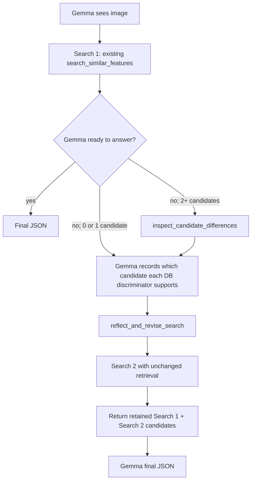

# Gemma 4 reflective iteration: implementation

## Status

Proposed and implemented on **2026-07-22**, revised the same day after review
(statistical power, manifest-safe resume, hard budgets, controlled retention, and a
condition-3 parity gate were added). This is the Phase 2 plan referenced from
[`00_plan.md`](./00_plan.md). No full-scale result below this line is real. Once a real run completes, results are appended to this
document. The spec above is the frozen contract; the "Results" section at the bottom
is the only part that changes after that.

## Decision

Evaluate reflection with the same **Gemma 4 E2B LiteRT-LM** baseline used by the
completed Phase 1 ablation. Do not use Qwen3-0.6B, Talk2DINO, the current Flutter
vision tools, a second critic model, or a different retrieval implementation in the
primary experiment.

The intervention is a bounded **database-grounded contrastive reflection** step:

1. Gemma sees the image and performs the existing first search.
2. If Search 1 has at least two candidates, Gemma asks the database tool for the visual
   traits that distinguish its provisional species from a plausible challenger. Empty
   and single-candidate results follow explicit no-inspection paths.
3. Gemma records which candidate each contrastive trait supports (or that it is unclear),
   identifies the unresolved discriminator, and submits one materially different query.
4. The tool performs Search 2 with the unchanged Phase 1 retrieval function and returns
   both searches' candidates with provenance.
5. Gemma selects the final species from the retained candidate pool.

Start with a hard limit of **two executed searches**. Test a third search only if the
two-search intervention passes the promotion gates below.

## Comparability contract

The following must be identical to
[`00_loop_ablation.py`](../../scripts/agent-loop-evaluation/00_loop_ablation.py):

| Component | Frozen value |
| --- | --- |
| Model | The exact Gemma 4 E2B `.litertlm` artifact from Phase 1; pin its path and SHA-256 before any measured run |
| Runtime | Pinned LiteRT-LM 0.14 environment (`.venv-export` on macOS); language and vision on GPU with Gemma 4 MTP speculative decoding enabled for every freshly run condition |
| Image input | Gemma receives the same image directly in the conversation |
| Evaluation set | A committed manifest of the same 332 image paths, labels, content hashes, order, and 64 species |
| Database | The same `assets/data/species_data.sqlite`; record its SHA-256 |
| Retrieval | `eval_gemma4_baseline._run_search`, `top_k=5`, unchanged weights and hard visual-group gate |
| Tool calling | LiteRT-LM native schemas; automatic execution for controls and application-validated manual execution for staged reflection |
| Sampler | temperature `0.3`, top-k `64`, top-p `0.85`, seed `31415926` |
| Scoring | `baseline.parse_json` and `baseline.score` |
| Image order | The committed manifest order and the same deduplication rules |

The run manifest must also pin the baseline source hash, runner source hash, each
condition's system prompt and tool-schema hash, and the candidate serializer version,
field order, truncation rules, and byte/token budget. The new runner must import the
Phase 1 baseline module exactly as the existing Phase 1 scripts do. It may wrap the
search tool to add state and reflection, but it must not change `_run_search`, candidate
confidence, JSON repair, species scoring, or ground truth. A changed hash starts a new
run; rows from different manifests must never be merged.

The current Qwen branch is a separate product experiment. It can adopt this pattern
later only after the Gemma result establishes whether reflection helps under a
comparable setup.

## Why the previous iteration pattern was insufficient

Phase 1 found that a second adaptive search call could recover useful candidates, but
that allowing up to four calls did not improve on the two-call condition, and the
two-call gain over fixed retrieval, while real-looking, missed conventional
significance. See [`01_loop-ablation.md`](./01_loop-ablation.md) for the numbers; they
are not repeated here.

The existing Gemma prompt says a low result means its assumptions are wrong and it
should "pivot entirely." That has four weaknesses:

- no structured record of the provisional answer or challenger;
- no explicit contrast between realistic candidates;
- no requirement that a changed query be justified by database evidence;
- no retained union, so a useful first-search candidate can disappear after revision.

A useful second pass should refine a discriminating uncertainty, not erase the first
pass and start over.

## Statistical power

Phase 2's promotion gates require a clean, significant effect on the same 332-image set
used throughout this track. Phase 1 already shows how hard that bar is here: the
two-call-vs-fixed-retrieval comparison found 57 wrong→correct against 38 correct→wrong
(95 discordant pairs out of 332 images, a +5.7pp difference) and still only reached
McNemar `p = 0.0648`.

Using the normal-approximation McNemar sample-size formula for detecting a discordant
split `r` away from 50/50,

```
n_discordant ≈ (z_(α/2) + z_β)² / (2r − 1)²
```

with `z_0.025 = 1.96`, `z_0.20 = 0.8416` (80% power), and `r = 57/95 ≈ 0.6` (the split
actually observed), 80% power at `α = 0.05` needs roughly:

```
(1.96 + 0.8416)² / (0.2)² = 7.84 / 0.04 ≈ 196 discordant pairs
```

That is about **twice** the 95 pairs Phase 1 produced. At Phase 1's ≈29% discordance rate
(95/332), reaching 196 discordant pairs at the same rate would need on the order of
**650–700 images**, roughly double the current set. Alternatively, a discordant split
further from 50/50 than 60/40 (i.e. a larger true effect than the one already observed)
would let 332 images reach adequate power.

This is an approximate, normal-theory calculation, not the exact test the promotion
gates require, and it assumes the reflective intervention's discordance rate and split
resemble Phase 1's. It is precise enough to carry one conclusion: **Phase 2 should not
assume 332 images will yield a clean significant result even if reflection genuinely
helps by a margin similar to Phase 1's.** If Phase 2 finds a positive but non-significant
effect, it must be reported as exploratory, per the promotion-gate note below, and used
to size a real holdout, not treated as a failed replication of a well-powered test.

## Research basis

The primary sources support structured feedback and externally grounded action, while
warning against assuming that "think again" is sufficient.

| Work | Design lesson for Mero |
| --- | --- |
| [ReAct, ICLR 2023](https://arxiv.org/abs/2210.03629) | Keep reasoning interleaved with native actions that obtain new information. |
| [Self-Refine, 2023](https://arxiv.org/abs/2303.17651) | Separate initial output, explicit feedback, and revision; test prompt-only self-feedback as an ablation. |
| [Reflexion, NeurIPS 2023](https://arxiv.org/abs/2303.11366) | Retain a compact reflection from evaluator feedback for the next attempt. |
| [CRITIC, 2023](https://arxiv.org/abs/2305.11738) | Ground correction in tool feedback instead of unaided introspection. Here the external source is the curated species database. |
| [LLMs Cannot Self-Correct Reasoning Yet, ICLR 2024](https://arxiv.org/abs/2310.01798) | Intrinsic self-correction can fail or degrade answers; this motivates the database-grounded condition and the prompt-only control. |
| [FLARE, 2023](https://arxiv.org/abs/2305.06983) | Form the next retrieval from the uncertainty exposed by the current attempt. |
| [Self-RAG, ICLR 2024](https://arxiv.org/abs/2310.11511) | Evaluate retrieval relevance and answer support separately, but do not copy its trained reflection-token method into Gemma LiteRT-LM. |
| [Corrective RAG, 2024](https://arxiv.org/abs/2401.15884) | Evaluate retrieved evidence before choosing a corrective retrieval action. |

This plan does not claim that these papers prove the intervention will work for species
identification. They justify the components to ablate.

## Proposed Gemma loop



Gemma remains the only vision-language model and the only agent. It chooses the
provisional species, challenger, visual interpretation, revised taxonomy, revised
traits, and final species. App-side Python code only:

- validates candidate and search IDs;
- computes deterministic differences between stored database traits;
- rejects duplicate queries;
- enforces the two-search budget;
- executes the unchanged search; and
- records traces and candidate provenance.

No app-side classifier decides whether an image matches a trait.

## Per-image state

Keep state inside the tool closure for one image and discard it afterward:

```text
executed_searches
attempted_tool_calls
searches: search_id -> normalized query + five returned candidates
candidate_pool: species_id -> source searches + ranks + confidences
inspection: evidence_id -> candidate pair + discriminating DB fields
provisional_answer
reflection
duplicate_query_hashes
protocol_errors
```

The trace written to JSONL contains the full state. The tool result sent back to Gemma
contains compact candidate data only; it must stay below a pre-measured context budget.

## Tool contracts

### 1. `search_similar_features`

Keep the existing signature, implementation, and top-five result. Add only:

- a stable `search_id`;
- stable DB row IDs for returned species;
- state recording; and
- the executed-search budget check.

Search 1 behaves identically to the existing two-call condition. A direct second call
to `search_similar_features` is rejected in the structured-reflection condition; the
second search must go through `reflect_and_revise_search`. This ordering requirement is
part of the intervention and is absent from the plain two-call control.

### 2. `inspect_candidate_differences`

Input:

```json
{
  "search_id": "s1",
  "provisional_species_id": 42,
  "challenger_species_id": 43
}
```

Validation:

- both IDs must be in Search 1's top five;
- IDs must differ;
- the provisional answer is recorded before inspection;
- unknown or stale IDs return a structured error and do not consume search budget.

The handler reads the stored `color`, `body_shape`, `distinctive_marks`, `texture`,
`size_class`, and `pattern` fields for both species. For each field it computes token
overlap using the same synonym normalization and Sørensen-Dice helper as retrieval.
It ranks discriminators by:

```text
(1 - candidate-to-candidate Dice overlap) * existing visual-field weight
```

It returns the top three differing fields plus both species' original database text.
This tool does **not** inspect the image or decide which candidate is correct. It asks
the curated database a narrower question: "What visible evidence would distinguish
these two candidates?" Gemma then compares those traits with the image it already sees.
The underlying feature text is already present in ordinary search results; the new tool
adds deterministic contrast and salience, not new biological facts. The instrumented
and prompt-only controls below test whether formatting alone explains any gain.

Output:

```json
{
  "inspection_id": "i1",
  "provisional_species_id": 42,
  "challenger_species_id": 43,
  "discriminators": [
    {
      "field": "distinctive_marks",
      "provisional": "broad cheek flanges and dark face",
      "challenger": "narrow face with lighter facial hair",
      "difference_score": 5.0,
      "evidence_id": "db_ev_1"
    }
  ]
}
```

This tool is unavailable when Search 1 has fewer than two candidates. If fewer than two
fields contain usable text, return
`status=insufficient_database_contrast`. Gemma may still revise, but the trace records
that the external database feedback was weak.

### 3. `reflect_and_revise_search`

This staged native action records the reflection and proposes the Search 2 query.
Application code validates the action and then executes Search 2 deterministically.

The tool keeps the query and evidence inputs flat rather than nesting them inside JSON
strings.

Input:

```json
{
  "provisional_species_id": 42,
  "challenger_species_id": 43,
  "revision_reason": "candidate_conflict",
  "evidence_summary": "broad cheek flanges are visible",
  "evidence_1_assessment": "supports_provisional",
  "evidence_2_assessment": "unclear",
  "evidence_3_assessment": "not_available",
  "color": "reddish brown with dark face",
  "shape": "large primate with long arms",
  "distinctive_marks": "broad cheek flanges",
  "texture": "long coarse hair",
  "size_class": "large",
  "pattern": "solid",
  "visualGroup": "Primate",
  "taxClass": "Mammalia",
  "taxOrder": "Primates",
  "taxFamily": "Hominidae",
  "taxGenus": "Pongo"
}
```

Allowed `revision_reason` values:

- `candidate_conflict`
- `visual_group_ambiguous`
- `retrieval_score_visual_mismatch`
- `retrieval_empty`

Every field is required by the native schema because that is more reliable with the
measured Gemma/LiteRT-LM bundle. Zero represents an unavailable candidate ID. Empty
query fields retain Search 1, while `__CLEAR__` explicitly removes a field. Each flat
assessment is `supports_provisional`, `supports_challenger`, `unclear`, or
`not_available`; its slot maps to the correspondingly numbered returned discriminator.
The short `evidence_summary` makes the visible comparison auditable without requesting
unrestricted chain-of-thought.

Reason-specific validation:

| Situation | Candidate IDs | Inspection/evidence | Query requirement |
| --- | --- | --- | --- |
| Two or more Search 1 candidates | provisional and challenger must match the staged choice | assessments required when at least two usable DB fields exist | at least one changed field tied to a returned discriminator when contrast is sufficient |
| One Search 1 candidate | provisional required, challenger is zero | assessment slots are `not_available` | at least one materially changed field |
| Empty Search 1 / `retrieval_empty` | both are zero | assessment slots are `not_available` | non-duplicate, materially changed query |

The handler rejects changed candidate IDs, invalid assessment values, repeated normalized
queries, unchanged queries, and invalid reason/field combinations. Rejected actions do
not execute Search 2 and get one explicit repair attempt.

On success it calls the unchanged `_run_search(..., top_k=5)`. The full trace always
stores both original search lists. The model-facing response uses one frozen envelope:

```json
{
  "candidate_pool": [
    {
      "species_id": 42,
      "scientific_name": "Pongo pygmaeus",
      "common_name": "Bornean Orangutan",
      "visual_features": "broad cheek flanges and dark face",
      "source_searches": ["s1", "s2"],
      "best_rank": 1,
      "best_confidence": 61
    }
  ],
  "pool_policy": "search_2_then_unique_search_1"
}
```

Condition 5 fills `candidate_pool` with Search 2's five candidates only. Condition 6
uses the same schema and serialization, placing Search 2 in original rank order first,
then only unique Search 1 candidates in their original rank order. There is no extra
summary or reranking index. This holds format and Search 2 salience constant while
adding only retained Search 1 candidates. Gemma receives at most ten compact candidates;
the exact fields, ordering, truncation, and context budget are frozen in the manifest.

## Prompt design

Conditions 5–6 use a finite sequence of fresh conversations, each exposing exactly one
native action. The application supplies the validated result to the next stage:

```text
1. Observe the image and emit one Search 1 action.
2. When at least two candidates exist, choose a provisional and challenger ID from the
   supplied list; deterministic code returns their contrast.
3. Assess the numbered contrast slots and emit one materially revised search action.
4. In a fresh tool-free conversation, select one `species_id` from the frozen pool.
```

Every rejected action gets one repair prompt containing the validation error. Do not ask
Gemma to reveal unrestricted chain-of-thought. The flat function arguments are a short,
auditable record of the provisional answer, image-to-database assessments, uncertainty,
and revised query.

## Enforced budgets and failure handling

- Maximum executed searches: **2**.
- Maximum successful inspections: **1** before Search 2.
- Maximum successful reflective revisions: **1**.
- Maximum total native tool calls: **8**, including rejected calls.
- Duplicate or invalid staged actions get one structured correction and do not execute search.
- Staged code has no path that can execute a third search; controls enforce the same cap
  inside their automatic search tool.
- If LiteRT-LM still emits more tool calls or never returns final JSON, mark the image as
  a protocol failure in the primary denominator.
- Runtime exceptions, malformed final JSON, and protocol failures remain distinct trace
  fields but all count as incorrect for accuracy.

LiteRT-LM's automatic loop in conditions 2–4 remains opaque between calls. The hard
guarantee for every condition is on **executed database searches**, which is the resource
and intervention Phase 2 evaluates.

## Experimental conditions

Run all conditions fresh with the comparability contract above. Store each exact prompt,
tool schema, and result serializer in the manifest:

| Condition | Retry prompt and tools | Search 2 response |
| --- | --- | --- |
| 1. Fixed retrieval | Exact Phase 1 fixed prompt; one existing search call | Existing response unchanged |
| 2. Plain two-call | Exact Phase 1 two-call prompt; existing search tool may be called twice | Existing response unchanged |
| 3. Instrumented plain two-call | Condition 2 prompt verbatim; direct second search allowed; stable IDs/state added | Frozen compact envelope with Search 2 only |
| 4. Prompt-only reflection | Condition 3 tools; prompt adds a provisional candidate, visible uncertainty, and materially changed-query checklist; no inspection/evidence fields | Same envelope as Condition 3, Search 2 only |
| 5. Structured reflection, second-list only | Staged Search 1, candidate choice, and revised-search actions above | Fresh ID selection from Search 2 only |
| 6. Structured reflection + retained pool | Identical staged deliberation to Condition 5 | Fresh ID selection from Search 2 then unique Search 1 candidates |

Condition 2 is the primary control. Condition 3 measures instrumentation/formatting,
Condition 4 tests whether self-feedback alone helps, and Conditions 5–6 separate the
value of structured contrast from the value of keeping Search 1 candidates available.

Conditions 5–6 perform final selection in a fresh, tool-free conversation so Search 1
cannot leak into the second-list-only branch. Conditions 1–4 retain their original
continuous conversation for baseline comparability. This makes condition 5 versus 6 a
clean retention comparison, but condition 4 versus 5 changes both database grounding
and selection-context availability; do not attribute that secondary gap to grounding
alone.

**Condition-3 parity gate.** Condition 3 changes only the tool's wire format relative to
Condition 2: same prompt, same search behavior. Before trusting conditions 4–6 (which
add real new tool-calling logic), Condition 3's species accuracy must reproduce
Condition 2's fresh run closely (no formal threshold is set here; a discrepancy large
enough to be visible without a significance test, e.g. more than one or two images
apart, should be investigated before proceeding). This is cheaper than a full
significance test and catches plumbing bugs, the kind that a hard-coded default (like
Phase 1's `passes` field silently defaulting to 0 for one condition) can introduce,
before they contaminate every later condition.

Do not compare the reflective Gemma condition to the Qwen app and do not reuse Qwen
results anywhere in the inferential table.

## Evaluation measurements

### Primary

- species top-1 and genus accuracy;
- exact paired McNemar test against fresh plain two-call;
- paired bootstrap interval, clustered by species;
- mean executed searches and total tool calls;
- session and mandatory per-image monotonic latency.

### Reflection-specific

- provisional-to-final accuracy transitions for every revised image;
- true-species availability in Search 1, Search 2, and their union;
- final selection accuracy conditional on union availability;
- percentage of revisions with a materially different query;
- accuracy by `revision_reason`;
- accuracy when database contrast is sufficient versus insufficient;
- challenger rank and whether the true species was chosen as provisional or challenger;
- candidate-retention rescues and regressions;
- protocol-error and duplicate-query rates.

The provisional ID is an elicited choice conditional on Gemma deciding to revise. It is
not a pass-one stopping answer and does not show that reflection caused a correction.
Report provisional-to-final transitions descriptively and separately from the paired
condition comparison. Images that stop after Search 1 expose their final answer, but no
counterfactual stopping answer is fabricated.

Run conditions in randomized matched blocks on the same hardware. Warm up the model
before measurement, record per-image monotonic wall time, rotate condition order within
each block, and record device/thermal metadata available from the runtime. The latency
gate is unevaluable, and promotion is blocked, if per-image timing is missing.

## Statistical plan

The 332-image set has already shaped this hypothesis, so this run is a preregistered
follow-up on an existing benchmark, not a pristine confirmatory holdout. Report that
limitation explicitly. See "Statistical power" above for why 332 images may not be
enough to reach significance even if the true effect resembles Phase 1's.

Use one primary fixed seed (`31415926`) for the inferential table so images, not repeated
seeds, remain the paired unit. Use two additional fixed seeds as robustness runs; do not
pool seed rows as independent observations. Require the structured-reflection accuracy
difference to have the same sign on both robustness seeds.

Pre-register one primary comparison: full structured reflection + retained pool versus
*fresh* plain two-call (not Phase 1's archived two-call numbers: reusing an already-run
condition as its own future baseline would understate variance). Use two-sided exact
McNemar `alpha=0.05`. Treat other comparisons as secondary and apply Holm correction.
Report the effect size and interval even when the test is not significant.

## Promotion gates

Call the reflection pattern successful only if all hold:

1. Species accuracy improves over fresh plain two-call by at least **5 percentage
   points**, exact McNemar `p < 0.05`, and the species-clustered 95% interval has a lower
   bound above zero.
2. The gain remains at least **3 percentage points** after excluding protocol-failure
   rows from both conditions; always retain the all-rows primary result.
3. The effect direction is positive on both robustness seeds.
4. At least 95% of images produce schema-valid final JSON without protocol failure.
5. No image executes more than two database searches.
6. Duplicate executed searches are below 1% of attempted revisions.
7. Paired median per-image latency rises by no more than 35% over fresh plain two-call
   under the randomized matched-block protocol.

If the effect is positive but underpowered on 332 images (a real possibility per the
"Statistical power" section above), report it as exploratory and use the observed
paired discordance to size a new holdout. Do not lower the gates after seeing results.

## Execution requirements

Six conditions on 332 images, with up to three seeds for the primary comparison, is
several times Phase 1's compute. Phase 1's own run needed four separate relaunches
because background processes in this environment are cut off after roughly 45 minutes
regardless of progress; only per-image resumable JSONL writes (`00_loop_ablation.py`'s
pattern: skip images already present on disk, keyed by image path) made finishing it
tractable in one session. The new runner must write per-image rows incrementally and
resume from disk on restart, for every condition, as a first-class design requirement,
not merely as something the resume-logic hash-matching test (below) happens to protect.
If termination occurs between the two structured selection branches, reconstruct the
missing branch from the completed row's hashed deliberation trace; never rerun a new
deliberation for only one branch. A crash-truncated final JSONL line may be removed, but
malformed interior rows and duplicates must fail explicitly.
Before scheduling the full run, estimate wall-clock time from the pilot's observed
seconds/image across all six conditions and expect to relaunch the run multiple times.
For process sharding, all `i/n` workers use the same full evaluation manifest and run ID,
write disjoint tagged JSONL files, and analysis merges and validates all `n` files before
computing a complete result.

## Implementation map

| File | Planned change |
| --- | --- |
| `scripts/agent-loop-evaluation/03_reflective_iteration.py` | New standalone Gemma 4 experiment; imports only the baseline; implements all six conditions and writes resumable per-image JSONL. |
| `scripts/agent-loop-evaluation/04_reflective_iteration_analysis.py` | Paired tests, transition analysis, candidate availability, retention, protocol failures, and cost summary. |
| `scripts/agent-loop-evaluation/README.md` | Exact command, model/runtime hashes, outputs, resume behavior, and limitations. |
| `outputs/agent-loop-evaluation/` | Per-condition JSONL, summaries, paired analysis, and run manifest. |

Do not modify the Flutter app for the first experiment. Only port the winning pattern
after the comparable Gemma evaluation succeeds.

## Tests before the model run

- Search 1 output matches the existing baseline byte-for-byte apart from added IDs.
- `_run_search` receives identical arguments and returns identical candidates for an
  unchanged query.
- Condition 3 reproduces Condition 2's fresh-run accuracy closely (the condition-3
  parity gate above), checked before conditions 4–6 are trusted.
- Candidate-difference ranking is deterministic and uses existing token normalization
  and field weights.
- Candidate IDs outside the staged Search 1 list and invalid assessment slots fail explicitly.
- Empty and one-candidate Search 1 cases can make a valid revision call.
- Normalized duplicate queries are rejected without executing search.
- Search 2 cannot execute before a valid reflection in structured conditions.
- A third database search can never execute.
- Both original candidate lists retain full trace provenance; the two model-facing pool
  policies use the same envelope, ordering, and serializer.
- The provisional answer is recorded before Search 2 executes.
- Resume logic never joins rows from different model, DB, prompt, or code hashes, and
  correctly skips images already written to disk on restart (execution requirement above).
- Runtime errors and malformed JSON become traceable incorrect rows.

## Risks

| Risk | Mitigation |
| --- | --- |
| Gemma invents visual support after seeing DB traits. | Require evidence IDs and measure whether reflection increases correct-to-wrong anchoring; prompt-only and second-list-only ablations locate the failure. |
| Database traits are not sufficiently discriminating. | Record insufficient-contrast cases and report their accuracy separately; do not fabricate a score. |
| Ten retained candidates amplify rank or confidence bias. | Preserve both source lists, record all positions, and compare the second-list-only condition against retained-pool presentation. |
| Reflection schema increases protocol failures. | Expose one compact native action per stage, validate IDs, allow one repair, count failures in the primary denominator, and cap total tool calls. |
| More tool calls erase the accuracy gain through latency. | Report latency beside accuracy and enforce the 35% promotion budget. |
| The same 332 images overstate generalization. | Label the run preregistered follow-up, then size a new holdout from observed discordance before any product claim. |
| 332 images may be underpowered even for a real effect. | See "Statistical power" above; treat a positive-but-non-significant result as exploratory, not as evidence against the intervention. |
| Six conditions across multiple seeds may not finish in one session. | Per-image resumable JSONL per condition (Execution requirements above) so a cut-off run continues without redoing completed images. |

## Recommended order

1. Recover and verify the exact Phase 1 model artifact/environment, then create the
   image content-hash manifest and baseline source hash.
2. Implement and unit-test deterministic candidate differences and state validation.
3. Smoke-test five non-measured images across all six conditions and inspect tool traces.
4. Freeze every prompt, schema, serializer, truncation rule, source file, and environment
   in the run manifest. Run `03_reflective_iteration.py --balanced-pilot` for a balanced
   64-image pilot, one deterministic image per species, only to
   reject broken schemas; any change invalidates and restarts the pilot. Check the
   condition-3 parity gate on this pilot before scaling up.
5. Without changing the manifest, run all six conditions on all 332 images with the
   primary seed.
6. Run the two robustness seeds without changing anything.
7. Analyze paired outcomes and append them to the Results section below.

## Expected outcome

The experiment should answer one narrow question: with the same Gemma 4 E2B LiteRT-LM
model and retrieval system, does a structured, database-grounded contrast before Search
2 make iteration more useful than the existing two-call prompt cap?

If not, Mero should keep the simpler Gemma loop rather than adding reflection or more
passes. If yes, only then should the pattern be ported to the current app branch and
re-evaluated there as a separate runtime.

## Results

### Run-fix note

Root cause: the structured-reflection tool was passing `image_evidence_assessments`
and `revised_query` as nested JSON strings, which was brittle in LiteRT-LM's tool
calling path. The failure pattern matched known LiteRT-LM tool-calling issues around
nested/serialized tool arguments and selection drift.

Reference: [LiteRT-LM issue #2418](https://github.com/google-ai-edge/LiteRT-LM/issues/2418)
and [issue #1027](https://github.com/google-ai-edge/LiteRT-LM/issues/1027).

Fix: the runner now uses flat tool arguments for reflection (`color`, `body_shape`,
`distinctive_marks`, `evidence_1_*`, etc.), tightens the closed-pool selection prompt,
and retries selection once if the first final answer falls outside the pool.

Not run yet. Nothing above the "Status" section at the top of this document is a
result. This section is where the six conditions' accuracy, the primary and secondary
comparisons, the promotion-gate outcome, and the reflection-specific analysis get
recorded once `03_reflective_iteration.py` and `04_reflective_iteration_analysis.py`
actually run against the deployed model on the full 332-image set.

### Aborted v1 pilot and staged v2 runner

The first real v1 attempt was stopped after roughly ten images per condition and moved
to `outputs/agent-loop-evaluation/reflective-iteration/aborted/`. This is diagnostic
pilot evidence, not a result: six of the first nine structured rows had protocol
failures. The recurring failures were invalid candidate IDs, attempts to call Search 1
again instead of the reflection tool, invalid revision reasons, and final identities
outside the supplied pool. Controls were substantially cleaner. Adding flat arguments
alone therefore did not solve the overloaded multi-tool conversation.

The replacement is
[`03_reflective_iteration.py`](../../scripts/agent-loop-evaluation/03_reflective_iteration.py),
a standalone implementation that imports only the frozen baseline search/scorer.
It retains the same model, GPU/speculative runtime, six condition names, retrieval,
scorer, randomized blocks, manifests, paired structured trace, and analysis format. It
changes only the structured intervention into four bounded stages:

1. Gemma emits one native Search-1 action from a required flat schema.
2. Given the returned top five, Gemma emits one native provisional/challenger action;
   deterministic code returns their database contrast.
3. Given that contrast, Gemma emits one native revised-search action. Empty fields retain
   Search 1; `__CLEAR__` explicitly removes a stale field. Only a validated action can
   execute Search 2.
4. Gemma selects a `species_id` from the frozen pool. Code hydrates canonical scientific,
   common, genus, and conservation fields from SQLite, preventing mixed or invented
   identities.

Each action gets at most one explicit repair attempt. Only exhausted repair attempts are
protocol failures; recovered actions remain recorded in the trace. No stage can execute
a third database search.

This design is based on primary examples rather than a framework recipe:

- LiteRT-LM's official [manual tool-calling example](https://github.com/google-ai-edge/LiteRT-LM/blob/main/docs/api/kotlin/getting_started.md)
  shows returning native tool calls to application code for validation/execution instead
  of automatically executing every emitted call.
- [Self-Refine](https://arxiv.org/abs/2303.17651) separates generation, feedback, and
  refinement while reusing the same model.
- [Reflexion](https://arxiv.org/abs/2303.11366) feeds explicit linguistic feedback into
  a later attempt rather than relying on an undifferentiated retry.
- [ReAct](https://arxiv.org/abs/2210.03629) motivates interleaving model decisions with
  external evidence. Here the interleaving is a finite state machine because the local
  Gemma pilot did not reliably choose among three simultaneously available tools.

Run a five-image smoke test first:

```bash
UV_CACHE_DIR=/tmp/mero-litert-uv-cache uv run --python .venv-export/bin/python \
  scripts/agent-loop-evaluation/03_reflective_iteration.py \
  --model-path ../sirkulab-mero-data/gemma-4-E2B-it.litertlm \
  --backend gpu --vision-backend gpu \
  --cache-dir /tmp/mero-litert-lm-cache --skip-warmup --limit 5
```

Do not launch 332 images until all five smoke images complete without runtime errors,
the structured stages actually execute two distinct searches, and manual inspection
confirms that repaired actions and candidate-ID selection are recorded correctly. A
successful smoke test starts a new manifest-pinned 64-image pilot; it does not revive or
merge the archived v1 rows.

### Completed balanced CPU pilot (2026-07-23)

The staged v2 implementation completed a balanced pilot with one deterministic image
for each of the 64 represented species. This is a real diagnostic result, but it is
**not** the preregistered 332-image primary experiment: both language and vision ran on
CPU rather than the GPU required by the comparability contract. The CPU run followed a
five-image GPU smoke test in which every structured request failed inside
`litert_lm_conversation_send_message`; the identical prompts and tool-contract hash ran
without runtime exceptions on CPU. The runtime difference therefore remains a blocker
for a comparable GPU experiment.

Run identity and artifacts:

- run ID: `646f421856c60be44eb7397f32de902166ec0d23fc55bf261dea9626e0eed519`;
- model SHA-256: `ab7838cdfc8f77e54d8ca45eadceb20452d9f01e4bfade03e5dce27911b27e42`;
- database SHA-256: `2b839f9e3c6499b79ee3c475f9027247a21b4f853ea7827954d0bf9f3f071e47`;
- sampler: temperature `0.3`, top-k `64`, top-p `0.85`, seed `31415926`;
- runtime: LiteRT-LM `0.14.0`, CPU language and vision backends, speculative decoding
  requested, mandatory warm-up completed;
- outputs: [`646f421856c60be4`](../../outputs/agent-loop-evaluation/reflective-iteration/646f421856c60be4/);
- paired analysis: [`analysis_summary.json`](../../outputs/agent-loop-evaluation/reflective-iteration/646f421856c60be4/analysis_summary.json).

All source, model, database, prompt, tool-contract, image, and serializer hashes matched
the manifest when analyzed. All six conditions completed 64 rows, for 384 total rows,
with no runtime exceptions. The elapsed time from manifest write through summary
generation was approximately 2 hours 50 minutes, including warm-up but excluding the
pre-manifest content hashing.

#### Condition results

Protocol and schema failures remain in the accuracy denominator and therefore count as
incorrect, as preregistered.

| Condition | Species top-1 | Genus | Mean searches | Mean latency | Schema valid | Schema + protocol clean |
| --- | ---: | ---: | ---: | ---: | ---: | ---: |
| Fixed retrieval | 22/64 (34.4%) | 22/64 (34.4%) | 1.00 | 16.76 s | 58/64 (90.6%) | 58/64 (90.6%) |
| Plain two-call | 25/64 (39.1%) | 29/64 (45.3%) | 1.27 | 27.83 s | 64/64 (100%) | 64/64 (100%) |
| Instrumented two-call | 27/64 (42.2%) | 29/64 (45.3%) | 1.22 | 29.22 s | 64/64 (100%) | 64/64 (100%) |
| Prompt-only reflection | 24/64 (37.5%) | 26/64 (40.6%) | 1.48 | 33.29 s | 64/64 (100%) | 64/64 (100%) |
| Structured reflection, Search 2 only | 15/64 (23.4%) | 17/64 (26.6%) | 1.78 | 41.89 s | 51/64 (79.7%) | 43/64 (67.2%) |
| Structured reflection, retained pool | 23/64 (35.9%) | 24/64 (37.5%) | 1.78 | 42.38 s | 59/64 (92.2%) | 50/64 (78.1%) |

The condition-3 instrumentation check was close but not identical: instrumented
two-call exceeded plain two-call by two images, or 3.1 percentage points. The paired
difference was not significant (`p=0.7539`, Holm-adjusted `p=1.0`), and both conditions
were schema- and protocol-clean. This does not look like a gross plumbing failure, but
the nonzero wire-format effect is another reason not to overinterpret a small pilot.

#### Erratum: Condition 3 is not a pure formatting control

The pre-run design above describes Condition 3 as changing "only the tool's wire format
relative to Condition 2: same prompt, same search behavior." That description is
incomplete, and the preceding paragraph inherits the error by calling the result a
"wire-format effect." Both statements are left as written, because they record what was
believed before the run.

Reading the two serializers side by side shows the difference is not only formatting.
`compact_candidate` in `03_reflective_iteration.py` emits an explicit `species_id` for
every candidate, while the Phase 1 serializer `format_tool_result` in
`eval_gemma4_baseline.py` emits a numbered list carrying common name, latin name,
confidence, and visual features, with no identifier. Condition 3 therefore changes the
tool-response representation in two ways at once: it reformats the response as JSON, and
it introduces stable species IDs that Condition 2 never had.

That matters for how the +3.1-point gap should be read. Stable IDs give the model an
unambiguous handle for referring to a candidate, which is a different kind of change
from reformatting the same text, so the gap is not evidence of a plumbing bug and is not
attributable to serialization alone. The parity gate remains useful as a plumbing check,
but it cannot serve as the pure formatting control the design intended, and the two
ingredients are not separable in this run. Separating them requires a further condition
that adds IDs without changing serialization, or changes serialization without adding
IDs. Neither was run.

#### Primary and secondary comparisons

The preregistered primary comparison did not improve accuracy. Retained structured
reflection scored 23/64 (35.9%) versus 25/64 (39.1%) for fresh plain two-call, a
**−3.1 percentage-point** difference. There were 12 control-wrong→structured-correct
and 14 control-correct→structured-wrong pairs. The two-sided exact McNemar result was
`p=0.8450`; the 10,000-sample species-clustered 95% interval for the difference was
`[−18.75, +12.50]` percentage points.

| Secondary condition versus plain two-call | Difference | Exact McNemar p | Holm-adjusted p |
| --- | ---: | ---: | ---: |
| Instrumented two-call | +3.1 pp | 0.7539 | 1.0000 |
| Prompt-only reflection | −1.6 pp | 1.0000 | 1.0000 |
| Structured reflection, Search 2 only | −15.6 pp | 0.0755 | 0.2266 |

The protocol-clean subset for the primary comparison showed `+8.0` percentage points
over 50 surviving pairs. That number is descriptive, not evidence that reflection
works: membership in the subset is determined by whether the structured condition
succeeded, so removing its 14 failures selects on post-treatment behavior. The
preregistered all-row result remains primary and is negative.

#### What reflection changed

The true species was present in Search 1 for 38/64 images (59.4%), in Search 2 for only
29/64 (45.3%), and in either list for 40/64 (62.5%). The paired availability transitions
were:

- present in both searches: 27;
- lost from Search 1 after revision: 11;
- newly recovered by Search 2: 2;
- absent from both: 24.

The reflective revision therefore produced a net loss of nine true-species candidate
appearances. This is the clearest mechanistic result from the pilot: the model's revised
query usually did not recover a missing candidate and often removed a useful one.

Retention partly repaired that damage. Against the identical shared deliberation,
retaining Search 1 changed nine Search-2-only errors to correct answers and changed one
correct answer to wrong; 14 remained correct and 40 remained wrong. This lifted the
structured condition from 15/64 to 23/64 (+12.5 percentage points). Candidate retention
is therefore useful inside this intervention, but the complete retained condition still
finished below the simpler plain two-call control.

The provisional-answer trace tells the same story. In the retained condition, final
selection matched the provisional candidate in 22 cases and was correct in 14 (63.6%).
It changed away from the provisional candidate in 37 cases and was correct in only 9
(24.3%). Descriptively, five correct provisional candidates became wrong finals, while
nine wrong provisional candidates became correct. These are elicited trace transitions,
not counterfactual pass-one accuracy, but they show that revision was far from reliably
corrective.

#### Protocol and selection failures

Sixteen of 64 revision actions needed the one allowed repair. Only two repairs
recovered; 14 exhausted the retry and produced `staged_revision_action_failed`, a 21.9%
structured-action failure rate. The 14 terminal validation errors were:

- failed to change a required database discriminator: 6;
- failed to produce a materially different query: 3;
- failed to mark unavailable evidence slots correctly: 3;
- emitted an invalid evidence-assessment value: 2.

All five empty-Search-1 cases failed the revision path. Gemma first used the wrong
revision reason, then its repair still violated either the evidence-slot or material
query-change requirement. This directly falsifies the pre-run test assumption that the
empty-search branch was operational for the measured model.

Both structured conditions share those 14 deliberation failures. Final selection added
further fragility: Search-2-only produced 13 non-object finals, while retained-pool
selection produced five. Combining schema and staged-protocol errors left 21/64 (32.8%)
Search-2-only rows and 14/64 (21.9%) retained-pool rows unclean. By contrast, plain,
instrumented, and prompt-only conditions were fully schema- and protocol-clean. Fixed
retrieval emitted an invalid confidence value in 6/64 rows.

No structured row executed more than two searches, all 50 executed revisions changed
the normalized query, and no executed structured revision duplicated Search 1. The hard
budget and duplicate-search safeguards worked as designed; model compliance with the
revision and selection contracts did not.

#### Latency and promotion decision

Retained structured reflection increased paired median latency by **65.9%** over plain
two-call, above the 35% gate. Its mean latency was 42.38 seconds versus 27.83 seconds.
Because this pilot used CPU, these values cannot substitute for the required GPU latency
measurement, but the gap is large enough to reject scaling the CPU protocol unchanged.

Promotion-gate status:

| Gate | Pilot status | Evidence |
| --- | --- | --- |
| Accuracy | Fail | −3.1 pp; `p=0.8450`; interval crosses zero |
| Protocol-clean gain | Pass, with selection-bias caveat | +8.0 pp over 50 surviving pairs |
| Two robustness seeds | Not run | No robustness runs exist |
| ≥95% schema- and protocol-clean | Fail | 78.1% for retained structured reflection |
| At most two searches | Pass | Maximum executed searches was 2 |
| <1% duplicate executed searches | Pass | 0/50 duplicates |
| ≤35% paired median latency increase | Fail | +65.9% |

The combined promotion decision is **fail**. Do not run a third search, scale this
protocol to the 332-image set, run robustness seeds, or port it into the app. The
current evidence favors keeping the simpler two-call loop. If this line of research is
continued, the next experiment should isolate candidate retention without mandatory
reflection, simplify or remove the brittle empty-search/evidence contract, and first
resolve why manual native tool calls fail on the required GPU backend.
