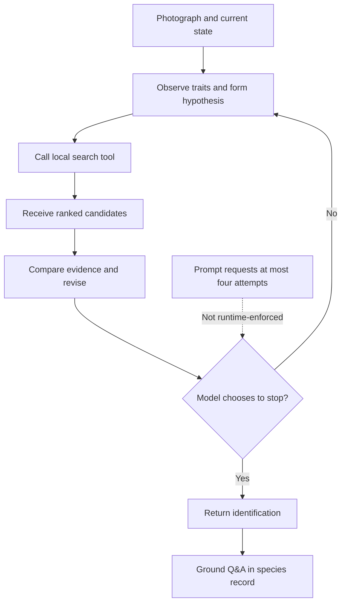

# Mero as an On-Device Multimodal Agent

[← Mero home](/sirkulab-mero/) · [Research notebook](/sirkulab-mero/research/) · [Source repository](https://github.com/atnanahidiw/sirkulab-mero)

> Mero is an on-device multimodal agent that identifies endangered species from a photo, calling a local retrieval tool, reading the ranked candidates, and deciding whether to revise its hypothesis before answering. This article evaluates that loop end to end, tracing where perception, retrieval, candidate presentation, and stopping each fail on their own, and testing whether letting the model iterate beats handing it one good candidate list and asking it to choose once. Across a 332-image evaluation and two controlled follow-up experiments, routing and candidate presentation reliably shape the outcome, but neither more adaptive search calls nor a structured, database-grounded reflection step reliably beat a single fixed retrieval pass.

A student can photograph a species, receive a confident answer, and never know that the correct species disappeared before the model compared candidates. That is the failure Mero investigates.

Mero is a bounded, tool-using multimodal agent. It interprets the photograph, sends structured queries to one local retrieval tool, observes the returned candidates, and may revise its decision. Unlike general-purpose autonomous agents, it works inside a fixed environment: one local tool, a fixed species database, a narrow identification objective, and actions that leave the environment unchanged. The research question is whether adaptive observation, retrieval, revision, and stopping produce more reliable decisions than a fixed pipeline, at an acceptable cost on a phone.

This perceive-act-observe loop follows the broad pattern studied in [ReAct](https://arxiv.org/abs/2210.03629). Mero evaluates it using the diagnostic principle found in [AgentBoard](https://arxiv.org/abs/2401.13178) and [ToolSandbox](https://arxiv.org/abs/2408.04682): final accuracy alone cannot reveal where an agent succeeds or fails. The experiments therefore separate perception, routing, retrieval, candidate presentation, selection, and stopping.

## Research question

**Can a resource-constrained multimodal agent reliably identify a species by forming a hypothesis, retrieving local evidence, revising its answer, and stopping when the available evidence is sufficient?**

Each step can fail independently. The model can misread the image, search the wrong part of the database, receive an incomplete candidate set, follow an unreliable score, select the wrong candidate despite seeing the correct one, or stop with confidence that does not match correctness. Evaluating only final accuracy would hide where those failures enter the loop.

## Research contribution

> Mero contributes a deployment-grounded study of failure propagation in a small on-device multimodal agent. Its current results show that hard visual routing can discard recoverable evidence, retrieval scores influence final selection despite lacking calibration, and candidate-position information is linearly decodable from selected hidden states. Two follow-up tests, letting the model make more adaptive search calls and adding a structured, database-grounded reflection step before a second search, have now both been run; the sharper result is not that neither beat retrieval but where the structured version lost ground, overwriting its own retrieved evidence between searches.

The table separates supported findings from causal claims and deployment questions that remain untested. Measured values for each row appear later, under What the experiments reveal and Cost.

| Claim | Status |
| --- | --- |
| Hard routing loses relevant candidates | Supported |
| Neighbor expansion increases in-sample retrieval recall | Supported |
| Expanded retrieval produced higher final accuracy in the current paired evaluation | Supported on the current dataset |
| Displayed scores causally affect selections | Supported by controlled permutations |
| Candidate rank affects likelihood | Supported in the HF text-only setting |
| Candidate-rank representation causes selection bias | Unconfirmed |
| Multiple tool calls improve identification | Tested, not established. No condition separated itself from a single fixed retrieval pass |
| Structured, database-grounded reflection improves a second search | Tested in a CPU pilot, not established. The pipeline's pool-replacement policy removed more candidates than it recovered |
| Current stopping policy is reliable | Not established. High confidence is only weakly predictive, and a stricter two-call cap beat the current four-call allowance |
| The loop is worth its device cost | Tested in part. Call and token cost are measured; latency, memory, energy, and device temperature are not |
| Results generalize to unseen species or field conditions | Untested |

## Agent architecture

The baseline uses Gemma 4 E2B through LiteRT-LM. Rather than identify a species in one response, Gemma proposes a coarse visual group and visible traits, calls a local tool named `search_similar_features`, reads the returned candidates, and decides whether to revise. The tool searches a curated SQLite database with FTS5 and reranks matches by weighted visual-feature similarity. After identification, the conversation is grounded in the selected species record.

The prompt tells Gemma to conclude after no more than four attempts. That is an instruction, not a runtime limit, and one recorded baseline case made five tool calls. The [baseline prompt and tool implementation](https://github.com/atnanahidiw/sirkulab-mero/blob/docs/scripts/gemma-improve-detection/eval_gemma4_baseline.py) ship with the evaluation code, since the prompt defines the search procedure, the 45% candidate-score guidance, the attempt limit, and the final JSON format.



| Agent component | Mero implementation                                                                                                        |
| --------------- | -------------------------------------------------------------------------------------------------------------------------- |
| Environment     | A photograph and an on-device species database                                                                             |
| Objective       | Identify the photographed species and explain its conservation context                                                     |
| Observation     | Image evidence, conversation state, and retrieved candidates                                                               |
| Policy          | Observe, hypothesize, search, compare, revise, and decide whether to stop                                                  |
| Action          | Send structured visual and taxonomic fields to `search_similar_features`                                                   |
| Tool            | Local FTS5 retrieval followed by visual-feature reranking                                                                  |
| Feedback        | Candidate identities, ordering, descriptions, and displayed confidence values                                              |
| State           | Current hypothesis, previous tool calls, retrieved evidence, and pass count                                                |
| Termination     | Gemma is prompted to stop after a visually supported match or four attempts, but the runtime does not enforce that ceiling |
| Output          | A species prediction followed by Q&A grounded in its curated record                                                        |

This table describes the Gemma 4 baseline studied in [Track 01](/sirkulab-mero/01_gemma-improve-detection/). [Track 00](/sirkulab-mero/00_smaller-footprint-pipeline/) also studies alternative architectures that separate vision from reasoning so a smaller text model can use a dedicated vision tool. Those experiments should not be treated as measurements of the baseline loop above.

## Example execution

The baseline output records tool arguments and final structured answers, but not the candidate list returned after each call. The traces below show only recorded fields. They do not reconstruct hidden reasoning or unrecorded tool output.

Two traces frame what revision can and cannot do, and both turn on changing the coarse visual group between calls. In the first, the change rescues the answer:

```text
Image: atelopus_varius_1.jpg
Ground truth: Atelopus varius

Call 1
Visual group: Lizard
Observed traits: dark skin with bright orange and yellow markings

Call 2
Revised visual group: Frog & toad

Final answer: Atelopus varius
Confidence: high
Result: correct
```

The second call corrected a coarse routing error and reached the right species. In the second trace the group changes on every call and the answer still drifts away from the truth:

```text
Image: cheilinus_undulatus_2.jpg
Ground truth: Cheilinus undulatus

Call 1: Marine mammal
Call 2: Marine fish
Call 3: Mollusk & marine invertebrate

Final answer: Tridacna gigas
Confidence: medium
Result: incorrect
```

Neither case measures frequency, but together they bracket the result Track 04 later quantifies: changing the requested group between calls is far more accurate than repeating it (43.5% versus 5.9% for two-call), while changing it is no guarantee on its own.

## Where the loop can fail

Mero's clearest result is a decomposition of identification into interfaces that can fail separately.

The first boundary lies between visual interpretation and retrieval. In the original design, Gemma's predicted `visual_group` acts as a hard database filter. If that coarse group is wrong, the true species may disappear before the model compares individual candidates. Every later component can operate normally while reasoning over an incomplete candidate set.

The second boundary lies between retrieval and synthesis. Making the correct species available does not ensure that Gemma selects it. A broader search recovers missing evidence, but it also introduces more alternatives. The model must still distinguish the correct species from plausible look-alikes.

The third boundary lies between candidate presentation and the final decision. Candidate order and displayed confidence are part of what the model reads. They are therefore inputs to the policy, even when the application treats them as neutral retrieval metadata.

The fourth boundary lies between representation and causal use. Track 03 finds that candidate position is strongly recoverable from hidden states, but the first activation-patching study does not show that candidate-local activations drive the final score. Information can be present inside the model without serving as the causal mechanism first expected.

A fifth boundary lies between an agent's revised action and the evidence its earlier actions already produced. Revising a search query does not only add candidates. It can also drop ones the first search already found, a hazard the retrieval literature calls query drift, and it turns out to be the clearest actionable finding in the Track 04 pilot below.

## What the experiments reveal

| Finding | Measured result | Evidence |
| --- | --- | --- |
| Hard routing often removes the true species | 157 of 332 surfaced, 47.3% retrieval recall | [Soft-gate evaluation](/sirkulab-mero/01_gemma-improve-detection/02_gemma4-soft-gate/) |
| Neighbor-expanded routing recovers evidence | 289 of 332 surfaced, 87.0% retrieval recall | [Soft-gate evaluation](/sirkulab-mero/01_gemma-improve-detection/02_gemma4-soft-gate/) |
| Better retrieval does not fully solve selection | Accuracy rose from 37.7% to 48.2% | [Soft-gate evaluation](/sirkulab-mero/01_gemma-improve-detection/02_gemma4-soft-gate/) |
| The requested attempt limit is not enforced | 1 of 332 cases made five tool calls | [Baseline failure analysis](/sirkulab-mero/01_gemma-improve-detection/01_gemma4-baseline-failure-analysis/) |
| Final confidence discriminates but is badly scaled | High-confidence answers were correct 51.9%, medium 28%, low 5%. Monotone in the right direction, but "high" still means roughly a coin flip | [Baseline failure analysis](/sirkulab-mero/01_gemma-improve-detection/01_gemma4-baseline-failure-analysis/) |
| Displayed confidence changes decisions | 33.1% of perturbed trials changed answer | [Confidence sensitivity](/sirkulab-mero/02_candidate-rank-sensitivity/02_confidence-score-sensitivity/) |
| Incorrect score assignment harms accuracy | Accuracy fell from 67.2% to 48.4% | [Confidence sensitivity](/sirkulab-mero/02_candidate-rank-sensitivity/02_confidence-score-sensitivity/) |
| Candidate position changes likelihood | Rank 1 minus rank 5 paired difference: 0.504 average log probability, 95% CI [0.415, 0.599] | [Logit rank-bias study](/sirkulab-mero/03_candidate-rank-mechanistic/01_hf-logit-rank-bias/) |
| Candidate position is linearly decodable | Candidate-identity split accuracy: 99.6% | [Candidate-position probing](/sirkulab-mero/03_candidate-rank-mechanistic/03a_candidate-position-probing/) |
| Candidate-local causality remains unconfirmed | Candidate-local patches did not clearly outperform matched controls | [Activation patching](/sirkulab-mero/03_candidate-rank-mechanistic/04_activation-patching-rank-bias/) |
| Adaptive iteration does not reliably beat fixed retrieval | Two-call 41.0% vs. 35.2% for fixed retrieval, `p = 0.0648`; four-call 37.7%, `p = 0.466` | [Loop ablation](/sirkulab-mero/04_agent-loop-evaluation/01_loop-ablation/) |
| Adaptivity at equal call count is unresolved | One-call and fixed retrieval both average 1.00 search calls; one-call estimated −1.5 points (33.7% vs. 35.2%), `p = 0.685`, 95% CI [−7.2, +4.2], at 98.9 mean tokens versus 91.5. Equal call count does not equalize cost. | [Loop ablation](/sirkulab-mero/04_agent-loop-evaluation/01_loop-ablation/) |
| A second call can recover a missing candidate | True species entered the top-five list on the final call for 39 of 332 two-call images, 26 correct | [Revision analysis](/sirkulab-mero/04_agent-loop-evaluation/02_revision-analysis/) |
| Revising the visual group beats repeating it | Changed-group retries were correct 43.5% (two-call) and 42.9% (four-call) of the time; same-group retries were correct only 5.9% and 13.0% | [Revision analysis](/sirkulab-mero/04_agent-loop-evaluation/02_revision-analysis/) |
| The two-call cap outperformed the four-call cap | 41.0% at 1.24 mean calls vs. 37.7% at 1.25 mean calls | [Stopping-policy comparison](/sirkulab-mero/04_agent-loop-evaluation/03_stopping-policy-comparison/) |
| Structured database-grounded reflection did not establish a benefit | 35.9% vs. 39.1% for a fresh two-call run, both rerun on this pilot's 64-image one-per-species subsample rather than the full 332, `p = 0.845`, missed the schema-validity and latency promotion gates. Against the pilot's own fixed-retrieval arm (34.4%) it was +1.6 points, `p = 1.0`, 95% CI [−12.5, +15.6] | [Reflective-iteration implementation](/sirkulab-mero/04_agent-loop-evaluation/04_reflective-iteration-implementation/) |
| Candidate replacement explains much of the worst structured result | Retaining the first search's candidates instead of replacing them was worth 12.5 points under an identical protocol and deliberation trace; the protocol-matched reflection contrast was inconclusive (37.5% vs. 42.2%, `p = 0.581`, 95% CI [−15.6, +6.3]) | [Reflective-iteration implementation](/sirkulab-mero/04_agent-loop-evaluation/04_reflective-iteration-implementation/) |

The routing results show how much evidence the first hypothesis can discard. Replacing the hard gate with neighbor-expanded retrieval raised recall by 39.7 percentage points without losing any cases from the original route. That establishes the value of recoverable retrieval. It does not establish that the exact 87.0% recall will hold on unseen data because the neighbor map was built from the same run's confusion matrix.

The native rerun shows the next problem. The gain in retrieval recall produced a smaller gain in final accuracy. The follow-up counted 54 cases that changed from wrong to correct and 19 that changed from correct to wrong, a net gain of 35 (37.7% to 48.2%). Because the same 332 images were scored under both routing policies, the difference is a paired one: a McNemar test on the 73 discordant cases gives χ² ≈ 15.8 (p < 0.001), and the 10.5-percentage-point improvement carries an approximate 95% confidence interval of 5.6 to 15.5 points. Fourteen of the nineteen regressions were within-group congener errors, and three more came from distractors introduced by neighboring groups. The broader route recovered more relevant evidence, but candidate discrimination and final selection limited the resulting accuracy gain.

Track 02 holds the photograph, candidate identities, and candidate order fixed while changing displayed confidence. The resulting answer changes show that retrieval scores are not passive annotations. Gemma treats them as evidence, although the scores are not calibrated probabilities of correctness. Rank also affects decisions, but less strongly in the far-separated candidate experiment.

Track 03 studies this effect through an inspectable Hugging Face backend. Moving the same candidate from rank 1 to rank 5 lowered its likelihood, and candidate position was nearly perfectly decodable from selected hidden-state features. Those findings do not prove how the deployed Android loop reaches its decisions. Tracks 01 and 02 primarily evaluate LiteRT-backed identification with images, while Track 03 uses text-only prompts and Hugging Face weights to inspect logits and activations. The mechanistic results constrain possible explanations, but they do not establish the decision mechanism used by the deployed multimodal system.

None of this is unique to Mero. It sits inside a known family of selection biases in list and multiple-choice settings, which have more than one cause. Some of the effect is positional: models favor certain answer positions largely independent of content ([Pezeshkpour and Hruschka](https://arxiv.org/abs/2308.11483)), and LLM judges lean toward whichever candidate is shown first in pairwise comparisons ([Wang et al.](https://arxiv.org/abs/2305.17926)). A separate line of work locates the bias in token identity instead: [Zheng et al.](https://arxiv.org/abs/2309.03882) find that models assign prior probability mass to specific option-ID tokens, and debias by estimating that prior rather than by reordering options.

The distinction matters here, because Mero's structured-reflection pipeline handed the model explicit species-ID tokens and its accuracy shifted (Track 04, Condition 3 below), which is at least consistent with an identity-based rather than a purely positional mechanism. The consistency is loose. Zheng's token bias is a learned prior over a small closed set of answer labels seen millions of times in training, and Mero's species IDs are arbitrary database keys with no such prior, so that specific mechanism does not transfer. What stable IDs more plausibly supply is referential stability, an unambiguous handle for pointing at a candidate across turns, which is the account Open Problems develops. What separates Mero from all of this work is scope: its candidates are grounded to database records with independently known correctness rather than lettered options or judge preferences, and Track 03 adds a linear probe on hidden states and an inconclusive causal-patching test.

Track 04 asks a different question about the same loop. Not whether candidate presentation biases a single decision, but whether acting on that decision repeatedly, calling the tool again and revising, beats deciding once from a fixed candidate list.

## Cost

Because Mero runs on a phone, accuracy is only one part of the comparison. Call count and token count do not depend on hardware, so both can be reported now. Token counts come from re-encoding each condition's saved final-turn text with the model's own tokenizer, since litert_lm's Python API exposes no native usage counter; the figures undercount every condition except direct identification, whose final turn is its only turn.

| Condition | Mean search calls | Species accuracy | Mean final-turn tokens |
| --- | ---: | ---: | ---: |
| Direct identification | 0.00 | 3.6% | 82.3 |
| Fixed retrieval | 1.00 | 35.2% | 91.5 |
| One-call | 1.00 | 33.7% | 98.9 |
| Two-call | 1.24 | 41.0% | 119.9 |
| Four-call | 1.25 | 37.7% | 118.6 |

Two-call and four-call cost almost the same, 1.24 calls against 1.25 and 119.9 tokens against 118.6, yet only two-call moved accuracy enough to be worth attention over fixed retrieval: `+5.7` points, `p = 0.0648`, with a bootstrap interval whose lower bound sits exactly at zero. The extra allowance in four-call bought nothing on either axis (`+2.4` points, `p = 0.466`). Neither is a demonstrated gain. Two-call is also the best-looking of several conditions and post-hoc contrasts with no multiplicity correction applied, so "worth watching" is doing deliberately modest work: the most favorable near-miss out of many comparisons is exactly where an uncorrected p-value overstates itself.

That zero lower bound next to `p = 0.0648` is a boundary case, not a contradiction. The two come from different procedures, a continuity-corrected McNemar chi-square and a 10,000-sample percentile bootstrap over images, and on discrete paired data a percentile bound can land on zero rather than just past it. Read it as touching zero, not excluding it.[^mcnemar]

A sharper comparison sits one row up. One-call and fixed retrieval cost identically in calls, 1.00 each, but not in tokens or accuracy: 98.9 against 91.5, and 33.7% against 35.2%. Equal call count does not equalize cost, since orchestration, input context, the unobserved search-turn generation, and the final turn all still differ and none of them is measured here. The accuracy estimate is small and uncertain, at `−1.5` points with `p = 0.685` and an approximate 95% interval of [−7.2, +4.2]. So letting the model choose whether and how to search, rather than having the app decide once, is a direction worth watching rather than a cost that has been shown. Treating a nonsignificant result as proof of an effect or of its absence is the inference the ASA cautions against ([Wasserstein and Lazar, 2016](https://doi.org/10.1080/00031305.2016.1154108); the ASA's [news release](https://www.amstat.org/asa/files/pdfs/p-valuestatement.pdf) restates the six principles and is freely readable).

Latency, memory, energy, and device temperature are device-specific, and those measurements are blocked rather than merely missing. The structured conditions were meant to run on GPU, but a five-image smoke test failed on every structured request inside `litert_lm_conversation_send_message` while the same prompts and tool-contract hash ran cleanly on CPU. The closest public report is [#2573](https://github.com/google-ai-edge/LiteRT-LM/issues/2573), recording the same C API call failing on the macOS GPU backend with a WebGPU/Metal `MapAsync` validation error. That reporter hit it with a 12B model through `litert-lm serve` under large context rather than Gemma 4 E2B through the Python API under structured tool calls, so the shared symptom does not establish a shared root cause. Until it resolves, on-device timing for the multi-call conditions is unavailable. A single-call baseline needs no multi-turn tool calling and is the natural first measurement to take, rather than reporting a same-device CPU number as if it stood in for phone economics.

## [Track 04: Agent-loop evaluation](/sirkulab-mero/04_agent-loop-evaluation/)

Track 04 ran the five planned conditions on the same 332 images; the Cost table above
gives their accuracies. A second call recovered the true species into the actual
top-five list on 39 cases, and 26 of those ended correctly. More allowance did not
improve the aggregate result.

The unconstrained baseline shows the same pattern observationally, with most images never
triggering a revision at all:

| Tool calls made | Images | Accuracy |
| ---: | ---: | ---: |
| 1 | 260 | 38.8% |
| 2 | 64 | 34.4% |
| 3 | 7 | 28.6% |
| 5 | 1 | 0% |

These figures do not show that extra calls reduce accuracy. Harder images are likelier to
trigger revision in the first place, and only eight cases went past two calls, so the
comparison confounds revision with the difficulty that caused it. Separating the two is
what the controlled conditions in the Cost table were run for.

Among images that made a second call, changing the requested visual group between calls
was far more accurate than repeating it: 43.5% versus 5.9% for two-call, 42.9% versus
13.0% for four-call. This is not causal, since harder images are likelier to both continue
and need a real revision, but the gap is large enough to watch in any agent that can
choose to repeat a failed action instead of changing it.

The experiment also narrowed what remains to be measured. Intermediate answers were
not observable, so the run could measure candidate recovery but not literal
wrong-to-correct transitions between calls. The stopping replays therefore report
agreement with observed stops, not counterfactual accuracy. See the
[loop ablation](/sirkulab-mero/04_agent-loop-evaluation/01_loop-ablation/),
[revision analysis](/sirkulab-mero/04_agent-loop-evaluation/02_revision-analysis/), and
[stopping comparison](/sirkulab-mero/04_agent-loop-evaluation/03_stopping-policy-comparison/).

A follow-up experiment asked whether a more structured second search does better than
the plain two-call condition: before revising its query, Gemma asks the database which
visual traits separate its provisional species from a plausible challenger. A 64-image
pilot did not establish that it does. The fully structured condition scored 35.9% against
39.1% for a fresh two-call run (`p = 0.845`) and missed the schema-validity and latency
promotion gates. Every percentage here is computed on the pilot's own 64-image
one-per-species subsample, so its 39.1% control is not the 41.0% two-call figure above;
the two measure the same condition on different samples and should not be read against
each other. Against the pilot's own fixed-retrieval arm (22/64, 34.4%), retained
structured reflection finished 1.6 points ahead (exact McNemar `p = 1.0`,
species-clustered 95% interval [−12.5, +15.6]) and plain two-call 4.7 points ahead
(`p = 0.664`), so neither separated itself from a single fixed retrieval pass. The
structured arm that discarded its first candidate pool did worse than either: at 23.4% it
sat an estimated 10.9 points below fixed retrieval (`p = 0.189`), unable to beat making
one pass and choosing once.

One thing does carry across the two runs. The two-call-versus-fixed-retrieval contrast
comes out at +5.7 points on the 332 images and +4.7 on the pilot's 64, which is stability
across two executions with stochastic decoding rather than replication on fresh data,
since every pilot image is drawn from the same 332.

The more useful result is what the pilot's control conditions show: most of the structured
condition's shortfall against plain two-call traces to something other than the reflection
step.

Reflection as an instruction is harder to isolate than it first looks, because the
prompt-only condition does not share plain two-call's tool-response representation. Plain
two-call returns tool results as a numbered text list, while both instrumented two-call
and prompt-only reflection return the enveloped JSON form carrying explicit species IDs.
The protocol-matched contrast is therefore prompt-only against instrumented two-call
rather than against plain: 37.5% versus 42.2%, a 4.7-point difference with 5 images
improving and 8 regressing, exact McNemar `p = 0.581`, and a species-clustered 95%
interval of [−15.6, +6.3] points. Read against plain two-call the same condition gives
−1.6 points, but that comparison mixes the reflection instruction with the
representation change and isolates neither. This ablation is exploratory and not
pre-registered; the pilot's primary comparison remains retained structured reflection
against plain two-call.

Neither reading supports a claim that reflection is inert. A pilot this size cannot
exclude a real effect in either direction, and it speaks only to a one-sentence prompt
addition, not to the heavier database-grounded reflection in the structured arms. What the
instruction did change is search policy: prompt-only executed a second search on 31 of 64
images against 14 of 64 for instrumented two-call, and every prompt-only row was schema-
and protocol-clean. The prompt worked as intended. It moved the agent's behavior
substantially without producing an accuracy difference this pilot could resolve.

Candidate replacement explains a large part of the rest. The two structured arms share a
single deliberation trace per image, because the run executes the staged reflection once
and feeds the identical model output to both, varying only whether the first search's
candidates stay in the pool alongside the second's. Holding the protocol, the prompt, and
the generated text fixed, discarding the first pool scored 23.4% and retaining it scored
35.9%, a 12.5-point swing attributable to nothing but that policy. The retrieval trace
shows the mechanism directly: revision dropped the true species from the candidate list 11 times
and recovered it only twice, a net loss of nine true-species appearances.

The discard was an artifact of the architecture rather than a deliberate design choice,
which is what makes it worth reporting. In the loose conditions each search returns its
candidates as a tool response inside a single conversation, so the first search's list is
still in the transcript when the model commits to an answer and evidence accumulates for
free. The structured pipeline replaced that implicit accumulation with an explicit
candidate pool passed to a separate selection call, and the explicit version defaulted to
carrying only the most recent search. The cost shows up clearly once you condition on the
true species being retrievable at all. Where it appeared in either search, prompt-only
reflection selected it 61.5% of the time and the retained structured arm 57.5%, against
37.5% for the arm that could no longer see it, and retrieval availability was almost
identical across the three at 39 to 40 images of 64.

That is query drift, a documented failure mode of query reformulation rather than of
self-correction. The information-retrieval literature frames it as a recall-versus-drift
tradeoff: reformulated queries can raise recall but routinely lose relevant documents the
original query had already retrieved, so naively swapping one query for another is a
gamble ([Venktesh et al.](https://arxiv.org/abs/2605.00560)). The compatible mitigation is
plain ensemble fusion, keeping the original query's results alongside the reformulated
ones rather than replacing them, which is the +12.5-point repair measured here
([Dhole et al.](https://arxiv.org/abs/2405.17658)). Mero's structured condition took the
gamble on every image. The design error this exposes is in state management rather than in
reasoning: the agent was permitted to overwrite its own evidence.

The structured protocol was expensive in reliability, not only in latency. Schema or
protocol failures hit 32.8% of rows in the discard-pool arm and 21.9% in the retained arm,
against 0% for both loose-tool conditions, and those failures count as incorrect in the
denominator as preregistered. That is an association, not a cause: the structured
conditions also changed the staging, the prompt, and the selection context, so schema
constraints are not isolated. Two nearby literatures offer analogies rather than
explanations. Whether format restrictions impair reasoning is contested, with
[Tam et al.](https://arxiv.org/abs/2408.02442) reporting that they do and the
structured-generation community arguing that this conflates constrained decoding with the
JSON-mode prompt, and that the effect reverses when the model may reason before
serializing ([dottxt-ai/outlines #1117](https://github.com/dottxt-ai/outlines/discussions/1117));
Mero's third-of-rows failure rate is severe evidence on one side without settling it.
[Li et al.](https://arxiv.org/abs/2606.25605) describe a closer mechanism, where
grammar-compiled token masks make tool-call tokens unreachable, though their GPT, Qwen, and
Nemotron models stopped calling tools altogether where Mero's kept calling and malformed
the calls. The association also leaves the protocol-burden and reflection-helps readings
entangled: on rows where the protocol held, the retained condition led by 8.0 points, but
membership in that subset depends on the treatment succeeding, so it selects on
post-treatment behavior and is descriptive only.

The revision step moved answers in both directions. Because the structured pipeline stages
a provisional answer before the second search, the pilot can see transitions the 332-image
ablation could not: five correct provisional answers became wrong finals and nine wrong
ones became correct, so revision was far from monotone but neither reliably corrective nor
reliably destructive. (The overthinking literature on
abandoning correct answers under long reasoning, [Zhou et al.](https://arxiv.org/abs/2604.10739),
concerns single-generation chains rather than staged tool calls, so it is an analogy, not
a match.)

One clarification about what kind of self-correction this pilot tested. Prompt-only
reflection is not intrinsic self-correction: the model revises a subsequent tool query
after receiving candidates from database retrieval, so external evidence stays in the loop
throughout. The critical survey literature turns on exactly that line, separating
self-generated feedback, which largely fails, from external feedback, which is where
self-correction tends to work ([Huang et al.](https://arxiv.org/abs/2310.01798),
[Kamoi et al.](https://arxiv.org/abs/2406.01297)). Mero's conditions sit on the external
side, so they neither confirm nor contradict the intrinsic-correction results.

Finally, the pilot bounds its own resolution. Condition 3 was meant to be an inert
formatting control and moved +3.1 points instead, which makes the tool-response
representation a research variable in its own right; Open Problems takes up what that
implies. The effect is comparable in size to the −4.7-point protocol-matched reflection
contrast sharing the same enveloped response, so with two changes of similar magnitude and
neither resolvable at 64 images, the pilot cannot say whether prompt-level reflection helps
or hurts. The structured condition was
slower as well: its median per-image latency ratio against plain two-call was 1.66, so a
typical image took 65.9% longer. That is a paired statistic and does not reconcile with
the unpaired means, which were 42.38 versus 27.83 seconds. Neither figure is
phone-representative given the CPU caveat below.

Candidate replacement is the only component isolated cleanly enough to act on. The
structured condition varies the tool protocol, the validation burden, the staging of tool
calls, the selection context, and the serialization format all at once, so the balance of
its gap against plain two-call stays confounded until those are moved one at a time.

This pilot ran on CPU because the required GPU backend currently fails on this
experiment's multi-turn tool calling in this environment, so a comparable GPU run is
still needed before the result can be treated as final. See the
[reflective-iteration implementation](/sirkulab-mero/04_agent-loop-evaluation/04_reflective-iteration-implementation/)
for the full method and pilot.

## How the research fits together

| Track                                                                            | Question                                                                          |
| -------------------------------------------------------------------------------- | --------------------------------------------------------------------------------- |
| [Track 00: Smaller footprint](/sirkulab-mero/00_smaller-footprint-pipeline/)     | Can Mero reduce its model and runtime footprint without losing its core behavior? |
| [Track 01: Detection failures](/sirkulab-mero/01_gemma-improve-detection/)       | Where do perception, routing, retrieval, and synthesis fail?                      |
| [Track 02: Candidate sensitivity](/sirkulab-mero/02_candidate-rank-sensitivity/) | How do candidate order, confidence, and explanations affect behavior?             |
| [Track 03: Mechanistic analysis](/sirkulab-mero/03_candidate-rank-mechanistic/)  | How is candidate position represented, and does it have a measurable causal role? |
| [Track 04: Agent-loop evaluation](/sirkulab-mero/04_agent-loop-evaluation/) | Does iteration improve decisions enough to justify its cost?                      |

One comparison frames everything else. Direct identification without retrieval scored 3.6%; a single fixed retrieval pass scored 35.2%. That 32-point gap is the largest effect in the article by an order of magnitude. No change to the loop came close: varying how many times the agent could search moved accuracy by 1.5 to 5.7 points, mostly inside the noise, and the two manipulations that did move it further, the 12.5-point candidate-retention swing and the 10.9-point cost of discarding the pool, are both about what evidence the agent keeps rather than how much it deliberates.

The direct arm is a floor, not a competing design. A 2B model cannot recall a specific database species from its weights, so no loop could have closed that gap; the number marks how much of this task is retrieval rather than pitting adaptivity against retrieval. The routing result makes the same point with database access held constant on both sides, where recovering lost candidates lifted recall from 47.3% to 87.0%. Retrieval quality does nearly all the work here, and the loop's adaptivity is close to a rounding error on top of it.

What remains is a narrow conclusion about a chain of fallible interfaces. The experiments show where evidence is lost and how candidate presentation influences the final choice, but neither the four-call prompt condition nor a structured, database-grounded reflection step outperformed fixed retrieval in the runs completed so far. The reflection pilot isolates one component of that shortfall: the agent replaced its candidate pool instead of extending it, which cost 12.5 points on its own. The reflection instruction itself stays unresolved, its protocol-matched contrast spanning both directions, and the rest of the structured-versus-plain gap stays confounded across protocol, validation, and serialization changes that were introduced together.

## Open problems

Four questions are open enough to shape what comes next.

Cost-aware stopping is unresolved. The prompt cap is not runtime-enforced, and one nominal four-call case ran five searches. Offline replays of alternative stopping rules agreed with the model's actual stop mostly by floor effect: most images stop after a single call the replay cannot second-guess, so agreement is 98.8% and 98.5% overall but 94.4% and 93.1% on the 72 multi-call images. Even that lower number is agreement with an observed stop rather than evidence the rule is good, since Gemma's answer at an earlier stop was never recorded. No run has paired accuracy with per-image latency, tokens, memory, energy, and temperature at once.

The next concrete step is a hard controller that records an answer after every search and is scored against those costs together rather than accuracy alone. The one attempt so far, the structured reflection step, could not run on the GPU backend (see Cost) and still needs direct robustness tests: empty results, malformed tool output, contradictory candidates, and confident synthesis after the true species is already retrieved.

Generalization is untested, and a post-hoc split of the existing set will not fix it. The article's own routing result already admits why: the neighbor map was built from this run's confusion matrix, and the confidence thresholds and prompt were shaped by looking at how the same 332 images scored. Once a dataset's outcomes have shaped the pipeline, every image in it is contaminated for evaluation, including images never used to derive one specific rule directly, so carving out some of the 332 afterward and calling it held-out does not test generalization.

Calibration is a scaling problem more than an absence of signal. Gemma's confidence label rank-orders correctness in the right direction, at 51.9% correct for high, 28% for medium, and 5% for low, so the high group is roughly twice as accurate as the rest rather than uninformative. It is simply miscalibrated, since "high" should not mean a coin flip. That monotonicity is what makes recalibration promising: rescaling an already-ordered signal is a far more tractable target than building a calibrated confidence from scratch. Whether such a rescaling holds up out of sample is the open question.

Whether tool-response serialization affects accuracy independent of content is untested beyond one small pilot. Condition 3 added explicit stable species IDs alongside JSON serialization while holding the prompt and retrieval implementation at plain two-call, and scored 3.1 points higher (42.2% versus 39.1%). At 64 images that is a signal worth chasing, not a result. The two ingredients need separating, because stable IDs give the model an unambiguous handle for referring to a candidate, which is a different kind of change from reformatting the same text. If either replicates at scale, a tool-calling agent's accuracy can shift on response-representation choices that look like implementation detail, which would matter well beyond Mero.

[^mcnemar]: Which McNemar variant appears where follows one rule throughout, not the result being tested: the continuity-corrected chi-square for the 332-image studies, and the exact test for the 64-image pilot, whose discordant counts are too small for the approximation to be dependable.
