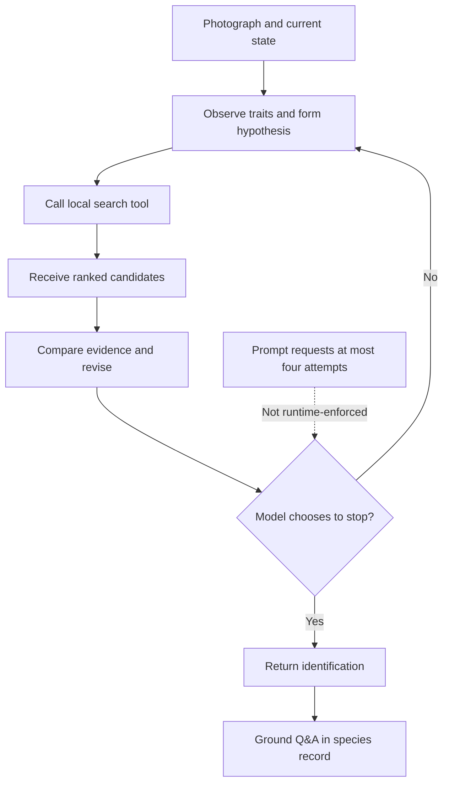

# Mero as an On-Device Multimodal Agent

[← Mero home](/sirkulab-mero/) · [Research notebook](/sirkulab-mero/research/) · [Source repository](https://github.com/atnanahidiw/sirkulab-mero)

> Mero is an on-device multimodal agent that identifies endangered species from a photo, calling a local retrieval tool, reading the ranked candidates, and deciding whether to revise its hypothesis before answering. This article evaluates that loop end to end, tracing where perception, retrieval, candidate presentation, and stopping each fail on their own, and testing whether letting the model iterate beats handing it one good candidate list and asking it to choose once. Across a 332-image evaluation and two controlled follow-up experiments, routing and candidate presentation reliably shape the outcome, but neither more adaptive search calls nor a structured, database-grounded reflection step reliably beat a single fixed retrieval pass.

A student can photograph a species, receive a confident answer, and never know that the correct species disappeared before the model compared candidates. That is the failure Mero investigates.

Mero is a bounded, tool-using multimodal agent. It interprets the photograph, sends structured queries to one local retrieval tool, observes the returned candidates, and may revise its decision. Unlike general-purpose autonomous agents, Mero operates within a bounded environment with one local tool, a fixed species database, and a narrow identification objective. Its action space is narrow, its species database is fixed, and its actions do not change the environment. The research question is whether adaptive observation, retrieval, revision, and stopping produce more reliable decisions than a fixed pipeline, at an acceptable cost on a phone.

This perceive-act-observe loop follows the broad pattern studied in [ReAct](https://arxiv.org/abs/2210.03629). Mero evaluates it using the diagnostic principle found in [AgentBoard](https://arxiv.org/abs/2401.13178) and [ToolSandbox](https://arxiv.org/abs/2408.04682): final accuracy alone cannot reveal where an agent succeeds or fails. The experiments therefore separate perception, routing, retrieval, candidate presentation, selection, and stopping.

## Research question

**Can a resource-constrained multimodal agent reliably identify a species by forming a hypothesis, retrieving local evidence, revising its answer, and stopping when the available evidence is sufficient?**

Each step can fail independently. The model can misread the image, search the wrong part of the database, receive an incomplete candidate set, follow an unreliable score, select the wrong candidate despite seeing the correct one, or stop with confidence that does not match correctness. Evaluating only final accuracy would hide where those failures enter the loop.

## Research contribution

> Mero contributes a deployment-grounded study of failure propagation in a small on-device multimodal agent. Its current results show that hard visual routing can discard recoverable evidence, retrieval scores influence final selection despite lacking calibration, and candidate-position information is linearly decodable from selected hidden states. Two follow-up tests, letting the model make more adaptive search calls and adding a structured, database-grounded reflection step before a second search, have now both been run, and neither reliably beat a fixed retrieval pipeline in the runs completed so far.

The table separates supported findings from causal claims and deployment questions that remain untested.

| Claim | Status |
| --- | --- |
| Hard routing loses relevant candidates | Supported |
| Neighbor expansion increases in-sample retrieval recall | Supported |
| Expanded retrieval produced higher final accuracy in the current paired evaluation | Supported on the current dataset |
| Displayed scores causally affect selections | Supported by controlled permutations |
| Candidate rank affects likelihood | Supported in the HF text-only setting |
| Candidate-rank representation causes selection bias | Unconfirmed |
| Multiple tool calls improve identification | Tested; not established (one-call underperformed fixed retrieval at equal call cost, 33.7% vs. 35.2%; two-call was best at 41.0%, `p = 0.0648`) |
| Structured, database-grounded reflection improves a second search | Tested in a CPU pilot; not established, and it removed more candidates than it recovered |
| Current stopping policy is reliable | Not established (high-confidence answers were correct only 51.9% of the time, and a stricter two-call cap outperformed the current four-call allowance) |
| The loop is worth its device cost | Tested in part (the four-call allowance bought no extra accuracy or token savings over two-call); per-image latency, memory, energy, and device temperature remain unmeasured |
| Results generalize to unseen species or field conditions | Untested |

## Agent architecture

The baseline uses Gemma 4 E2B through LiteRT-LM. Instead of asking the model to identify a species in one response, Mero gives it a local tool named `search_similar_features`. The tool searches a curated SQLite database with FTS5 and reranks matches using weighted visual-feature similarity.

Gemma observes the photograph, proposes a coarse visual group and visible traits, calls the tool, reads the returned candidates, and decides whether to revise its hypothesis. The prompt tells Gemma to conclude after no more than four attempts. This is an instruction to the model, not a hard runtime limit. One recorded baseline case made five tool calls. After identification, the conversation is grounded in the selected species record.

The exact [baseline prompt and tool implementation](https://github.com/atnanahidiw/sirkulab-mero/blob/docs/scripts/gemma-improve-detection/eval_gemma4_baseline.py) are published with the evaluation code. This matters because the prompt defines the search procedure, the 45% candidate-score guidance, the requested attempt limit, and the final JSON format.



| Agent component | Mero implementation                                                                                                        |
| --------------- | -------------------------------------------------------------------------------------------------------------------------- |
| Environment     | A photograph and an on-device species database                                                                             |
| Objective       | Identify the photographed species and explain its conservation context                                                     |
| Observation     | Image evidence, conversation state, and retrieved candidates                                                               |
| Policy          | Observe, hypothesize, search, compare, revise, and decide whether to stop                                                  |
| Action          | Send structured visual and taxonomic fields to `search_similar_features`                                                   |
| Tool            | Local FTS5 retrieval followed by visual-feature reranking                                                                  |
| Feedback        | Candidate identities, ordering, descriptions, and displayed confidence values                                              |
| State           | Current hypothesis, previous tool calls, retrieved evidence, and pass count                                                |
| Termination     | Gemma is prompted to stop after a visually supported match or four attempts, but the runtime does not enforce that ceiling |
| Output          | A species prediction followed by Q&A grounded in its curated record                                                        |

This table describes the Gemma 4 baseline studied in [Track 01](/sirkulab-mero/01_gemma-improve-detection/). [Track 00](/sirkulab-mero/00_smaller-footprint-pipeline/) also studies alternative architectures that separate vision from reasoning so a smaller text model can use a dedicated vision tool. Those experiments should not be treated as measurements of the baseline loop above.

## Example execution

The baseline output records tool arguments and final structured answers, but not the candidate list returned after each call. The traces below show only recorded fields. They do not reconstruct hidden reasoning or unrecorded tool output.

### Successful revision

```text
Image: atelopus_varius_1.jpg
Ground truth: Atelopus varius

Call 1
Visual group: Lizard
Observed traits: dark skin with bright orange and yellow markings

Call 2
Revised visual group: Frog & toad

Final answer: Atelopus varius
Confidence: high
Result: correct
```

The second call repaired the coarse routing error and ended with the correct species. This shows that revision can work in an individual case. It does not measure how often revision helps across the dataset.

### Failed revision

```text
Image: cheilinus_undulatus_2.jpg
Ground truth: Cheilinus undulatus

Call 1: Marine mammal
Call 2: Marine fish
Call 3: Mollusk & marine invertebrate

Final answer: Tridacna gigas
Confidence: medium
Result: incorrect
```

This run reached the correct coarse group on its second call, then moved away from it and returned the wrong organism. More calls did not guarantee a better final decision. As with the successful trace, one case illustrates a path through the loop rather than its frequency.

## Where the loop can fail

Mero's clearest result is a decomposition of identification into interfaces that can fail separately.

The first boundary lies between visual interpretation and retrieval. In the original design, Gemma's predicted `visual_group` acts as a hard database filter. If that coarse group is wrong, the true species may disappear before the model compares individual candidates. Every later component can operate normally while reasoning over an incomplete candidate set.

The second boundary lies between retrieval and synthesis. Making the correct species available does not ensure that Gemma selects it. A broader search recovers missing evidence, but it also introduces more alternatives. The model must still distinguish the correct species from plausible look-alikes.

The third boundary lies between candidate presentation and the final decision. Candidate order and displayed confidence are part of what the model reads. They are therefore inputs to the policy, even when the application treats them as neutral retrieval metadata.

The fourth boundary lies between representation and causal use. Track 03 finds that candidate position is strongly recoverable from hidden states, but the first activation-patching study does not show that candidate-local activations drive the final score. Information can be present inside the model without serving as the causal mechanism first expected.

A fifth boundary showed up in a Track 04 follow-up pilot on a more structured revision step. Revising a search query does not only add candidates, it can also drop ones the first search already found. In a 64-image pilot, the true species was present after the first search for 38 images but only 29 after the required second search, a net loss of nine appearances. Keeping candidates from both searches recovered most of that loss, but the combined condition still finished behind a plain two-call baseline. See [Track 04](/sirkulab-mero/04_agent-loop-evaluation/04_reflective-iteration-implementation/) for the full pilot.

## What the experiments reveal

| Finding | Measured result | Evidence |
| --- | --- | --- |
| Hard routing often removes the true species | 157 of 332 surfaced, 47.3% retrieval recall | [Soft-gate evaluation](/sirkulab-mero/01_gemma-improve-detection/02_gemma4-soft-gate/) |
| Neighbor-expanded routing recovers evidence | 289 of 332 surfaced, 87.0% retrieval recall | [Soft-gate evaluation](/sirkulab-mero/01_gemma-improve-detection/02_gemma4-soft-gate/) |
| Better retrieval does not fully solve selection | Accuracy rose from 37.7% to 48.2% | [Soft-gate evaluation](/sirkulab-mero/01_gemma-improve-detection/02_gemma4-soft-gate/) |
| The requested attempt limit is not enforced | 1 of 332 cases made five tool calls | [Baseline failure analysis](/sirkulab-mero/01_gemma-improve-detection/01_gemma4-baseline-failure-analysis/) |
| Final confidence is an imperfect correctness signal | 81 of 156 high-confidence answers were correct, 51.9% | [Baseline failure analysis](/sirkulab-mero/01_gemma-improve-detection/01_gemma4-baseline-failure-analysis/) |
| Displayed confidence changes decisions | 33.1% of perturbed trials changed answer | [Confidence sensitivity](/sirkulab-mero/02_candidate-rank-sensitivity/02_confidence-score-sensitivity/) |
| Incorrect score assignment harms accuracy | Accuracy fell from 67.2% to 48.4% | [Confidence sensitivity](/sirkulab-mero/02_candidate-rank-sensitivity/02_confidence-score-sensitivity/) |
| Candidate position changes likelihood | Rank 1 minus rank 5 paired difference: 0.504 average log probability, 95% CI [0.415, 0.599] | [Logit rank-bias study](/sirkulab-mero/03_candidate-rank-mechanistic/01_hf-logit-rank-bias/) |
| Candidate position is linearly decodable | Candidate-identity split accuracy: 99.6% | [Candidate-position probing](/sirkulab-mero/03_candidate-rank-mechanistic/03a_candidate-position-probing/) |
| Candidate-local causality remains unconfirmed | Candidate-local patches did not clearly outperform matched controls | [Activation patching](/sirkulab-mero/03_candidate-rank-mechanistic/04_activation-patching-rank-bias/) |
| Adaptive iteration does not reliably beat fixed retrieval | Two-call 41.0% vs. 35.2% for fixed retrieval, `p = 0.0648`; four-call 37.7%, `p = 0.466` | [Loop ablation](/sirkulab-mero/04_agent-loop-evaluation/01_loop-ablation/) |
| Adaptivity can cost accuracy at equal call budget | One-call and fixed retrieval both average 1.00 search calls; fixed retrieval reached 35.2% at 91.5 mean tokens versus one-call's 33.7% at 98.9 | [Loop ablation](/sirkulab-mero/04_agent-loop-evaluation/01_loop-ablation/) |
| A second call can recover a missing candidate | True species entered the top-five list on the final call for 39 of 332 two-call images, 26 correct | [Revision analysis](/sirkulab-mero/04_agent-loop-evaluation/02_revision-analysis/) |
| Revising the visual group beats repeating it | Changed-group retries were correct 43.5% (two-call) and 42.9% (four-call) of the time; same-group retries were correct only 5.9% and 13.0% | [Revision analysis](/sirkulab-mero/04_agent-loop-evaluation/02_revision-analysis/) |
| The two-call cap outperformed the four-call cap | 41.0% at 1.24 mean calls vs. 37.7% at 1.25 mean calls | [Stopping-policy comparison](/sirkulab-mero/04_agent-loop-evaluation/03_stopping-policy-comparison/) |
| Structured database-grounded reflection did not help either | 35.9% vs. 39.1% for a fresh two-call run, `p = 0.845`, missed the schema-validity and latency promotion gates | [Reflective-iteration implementation](/sirkulab-mero/04_agent-loop-evaluation/04_reflective-iteration-implementation/) |

The routing results show how much evidence the first hypothesis can discard. Replacing the hard gate with neighbor-expanded retrieval raised recall by 39.7 percentage points without losing any cases from the original route. That establishes the value of recoverable retrieval. It does not establish that the exact 87.0% recall will hold on unseen data because the neighbor map was built from the same run's confusion matrix.

The native rerun shows the next problem. The gain in retrieval recall produced a smaller gain in final accuracy. The follow-up counted 54 cases that changed from wrong to correct and 19 that changed from correct to wrong, a net gain of 35 (37.7% to 48.2%). Because the same 332 images were scored under both routing policies, the difference is a paired one: a McNemar test on the 73 discordant cases gives χ² ≈ 15.8 (p < 0.001), and the 10.5-percentage-point improvement carries an approximate 95% confidence interval of 5.6 to 15.5 points. Fourteen regressions were within-group congener errors, while three came from distractors introduced by neighboring groups. The broader route recovered more relevant evidence, but candidate discrimination and final selection limited the resulting accuracy gain.

Track 02 holds the photograph, candidate identities, and candidate order fixed while changing displayed confidence. The resulting answer changes show that retrieval scores are not passive annotations. Gemma treats them as evidence, although the scores are not calibrated probabilities of correctness. Rank also affects decisions, but less strongly in the far-separated candidate experiment.

Track 03 studies this effect through an inspectable Hugging Face backend. Moving the same candidate from rank 1 to rank 5 lowered its likelihood, and candidate position was nearly perfectly decodable from selected hidden-state features. Those findings do not prove how the deployed Android loop reaches its decisions. Tracks 01 and 02 primarily evaluate LiteRT-backed identification with images, while Track 03 uses text-only prompts and Hugging Face weights to inspect logits and activations. The mechanistic results constrain possible explanations, but they do not establish the decision mechanism used by the deployed multimodal system.

This pattern sits inside a known family of position effects in list and multiple-choice settings rather than something unique to Mero. Prior work finds that models often favor certain answer positions in multiple-choice questions largely independent of content ([Pezeshkpour and Hruschka](https://arxiv.org/abs/2308.11483), [Zheng et al.](https://arxiv.org/abs/2309.03882)), and that LLM judges show a related bias toward whichever candidate is shown first in pairwise comparisons ([Wang et al.](https://arxiv.org/abs/2305.17926)). Mero's setting differs mainly in scope: its candidates are grounded to database records with independently known correctness rather than lettered options or free-form judge preferences, and Track 03 pushes the behavioral effect one step further with a linear probe on hidden states and an inconclusive causal-patching test.

Track 04 asks a different question about the same loop: not whether candidate presentation biases a single decision, but whether letting the model act on that decision repeatedly, calling the tool again and revising, beats deciding once from a fixed candidate list. The six rows above summarize the measured result; the full ablation, revision analysis, and stopping-policy and reflection detail follow later in this article and in the Track 04 reports linked there.

## What remains unknown

Track 04 did not establish that Mero's four-call prompt condition outperforms a one-pass
retrieval pipeline. The two-call condition was best at 41.0% versus 35.2% for fixed
retrieval, but the paired result was borderline (`p = 0.0648`). The four-call prompt
condition reached 37.7% and was not reliably better than fixed retrieval (`p = 0.466`).

In the 332-image native baseline, 260 cases used one tool call, 64 used two, 7 used three, and 1 used five. Observed accuracy was 38.8%, 34.4%, 28.6%, and 0% in those groups. These figures do not show that extra calls reduce accuracy. Harder examples are more likely to trigger revision, and only eight cases made more than two calls. A controlled pass-count comparison is needed to separate the effect of revision from the difficulty that caused the model to continue.

Stopping remains unresolved as a counterfactual policy. Offline unchanged-hypothesis and
evidence-threshold replays agreed with where the model actually stopped on 98.8% and
98.5% of all 332 images, but that is mostly a floor effect: 260 of those images stopped
after a single call, which neither replay rule can second-guess. Restricted to the 72
images that made more than one call, agreement drops to 94.4% and 93.1%. LiteRT-LM did
not expose the answers Gemma would have produced at those earlier stops, so even the
lower number is agreement with an observed stop, not evidence that either rule is a good
stopping policy. The prompt cap was also not runtime-enforced: one nominal four-call
case made five searches. A hard controller with an answer recorded after every search is
still needed.

A first attempt at such a controller, the structured reflection step described above,
did not clear its own promotion gates in a small pilot, and that pilot ran on CPU rather
than the GPU the comparability contract requires: the GPU backend currently fails on
this experiment's multi-turn manual tool calling in this environment, matching known
LiteRT-LM issues around nested or serialized tool arguments and selection drift
([#2418](https://github.com/google-ai-edge/LiteRT-LM/issues/2418),
[#1027](https://github.com/google-ai-edge/LiteRT-LM/issues/1027)). Resolving that
backend gap is itself an open item before the reflection question can be tested properly.

The full loop also needs direct robustness tests. Relevant cases include empty search results, malformed tool output, contradictory candidates, repeated calls, and confident synthesis after the correct species has been retrieved.

Because Mero runs on a phone, accuracy is only one part of the comparison, and cost splits into two kinds with different fixes.

Call count and token count are both device-agnostic: neither depends on which hardware executes the calls, so both can be reported now. Token counts come from re-encoding each condition's saved final-turn text with the model's own tokenizer, since litert_lm's Python API does not expose a native usage counter.

| Condition | Mean search calls | Species accuracy | Mean final-turn tokens |
| --- | ---: | ---: | ---: |
| Direct identification | 0.00 | 3.6% | 82.3 |
| Fixed retrieval | 1.00 | 35.2% | 91.5 |
| One-call | 1.00 | 33.7% | 98.9 |
| Two-call | 1.24 | 41.0% | 119.9 |
| Four-call | 1.25 | 37.7% | 118.6 |

Two-call and four-call cost almost the same in calls, 1.24 versus 1.25, and in tokens, 119.9 versus 118.6, yet only two-call showed a real accuracy gain over fixed retrieval; the extra allowance in four-call bought essentially nothing on either axis. A sharper comparison sits one row up: one-call and fixed retrieval cost identically in calls, 1.00 each, but not in tokens or accuracy, 98.9 versus 91.5 and 33.7% versus 35.2%. Because the call budget is tied, that gap cannot be a cost story; the adaptive framing itself, letting the model choose whether and how to search rather than the app deciding once, cost accuracy here even at equal call count. This is consistent with the family of findings that added input length can hurt performance on its own, separately from whether the right evidence was retrieved ([Du et al.](https://arxiv.org/abs/2510.05381)); that result is shown at context lengths of thousands of tokens, so the gap here (98.9 versus 91.5 tokens) is suggestive of the same mechanism rather than a confirmed instance of it at this much smaller scale. The token column undercounts total generation for every condition except direct: it is the text of only the last recorded turn, and `litert_lm`'s `automatic_tool_calling` loop does not expose the text of the search-time turns that came before it. Direct identification is the one row where the final turn is the only turn, so its number is a true total rather than a lower bound.

Latency, memory, energy, and device temperature are device-specific, and that measurement is currently blocked rather than simply missing. The multi-turn tool-calling issue that stalled a comparable GPU run for the reflection pilot ([#2418](https://github.com/google-ai-edge/LiteRT-LM/issues/2418), [#1027](https://github.com/google-ai-edge/LiteRT-LM/issues/1027)) blocks on-device timing for the same multi-call conditions. A single-call baseline does not require multi-turn tool calling and may still be measurable on-device; that is the natural next step, not a same-device CPU number reported as if it stood in for phone economics.

## [Track 04: Agent-loop evaluation](/sirkulab-mero/04_agent-loop-evaluation/)

Track 04 ran the five planned conditions on the same 332 images. Fixed retrieval reached
35.2%, one adaptive call 33.7%, two calls 41.0%, and the four-call prompt condition
37.7%; direct identification without retrieval reached 3.6%. A second call recovered
the true species into the actual top-five list on 39 cases and 26 of those ended
correctly. More allowance did not improve the aggregate result.

Among images that made a second call, changing the requested visual group between calls
was descriptively far more accurate than repeating it: 43.5% versus 5.9% for two-call,
42.9% versus 13.0% for four-call. This is not a causal result: harder images are more
likely to both continue and need a real revision, the same-group group is small, and a
model can revise its underlying traits without changing the coarse group label. It is
still a large enough gap to be worth watching in any agent that can choose to repeat a
failed action instead of changing it.

The experiment also narrowed what remains to be measured. Intermediate answers were
not observable, so the run could measure candidate recovery but not literal
wrong-to-correct transitions between calls. The stopping replays therefore report
agreement with observed stops, not counterfactual accuracy. See the
[loop ablation](/sirkulab-mero/04_agent-loop-evaluation/01_loop-ablation/),
[revision analysis](/sirkulab-mero/04_agent-loop-evaluation/02_revision-analysis/), and
[stopping comparison](/sirkulab-mero/04_agent-loop-evaluation/03_stopping-policy-comparison/).

A follow-up experiment asked whether a more structured second search does better than
the plain two-call condition: before revising its query, Gemma asks the database which
visual traits separate its provisional species from a plausible challenger. A 64-image
pilot found it does not. The fully structured condition scored 35.9% versus 39.1% for a
fresh two-call run (`p = 0.845`), missed the schema-validity and latency promotion
gates, and, as noted above, lost more true-species candidates from the first search than
it recovered in the second. That pattern lines up with reports that intrinsic
self-correction in LLMs can fail to improve, or even degrade, an answer without
reliable external feedback ([Huang et al.](https://arxiv.org/abs/2310.01798)); here the
database contrast was meant to be that external feedback, and it still did not help.
The pilot's own provisional-to-final trace shows a similar shape: five of its correct
provisional answers became wrong after revision, while nine wrong ones became correct.
That is consistent with recent evidence that extended test-time reasoning is associated
with abandoning previously correct answers rather than only fixing wrong ones
([Zhou et al.](https://arxiv.org/abs/2604.10739)), though that result is about
single-generation chain-of-thought length rather than Mero's discrete, multi-turn
tool-calling revisions, so the mechanisms may not be identical.

The pilot also isolated a wire-format effect large enough to flag; see Open Problems
below for the question it raises. And the accuracy loss from structured reflection was
not the only cost: on this CPU pilot, its paired median latency was 65.9% higher than
plain two-call (42.38 versus 27.83 seconds mean), so the structured condition was slower
as well as less accurate. Neither number is phone-representative given the CPU caveat
below, but together they describe a design that cost more and returned less on every
axis measured here.
This pilot ran on CPU because the required GPU backend currently fails on this
experiment's multi-turn tool calling in this environment, so a comparable GPU run is
still needed before the result can be treated as final. See the
[reflective-iteration implementation](/sirkulab-mero/04_agent-loop-evaluation/04_reflective-iteration-implementation/)
for the full method and pilot.

## How the research fits together

| Track                                                                            | Question                                                                          |
| -------------------------------------------------------------------------------- | --------------------------------------------------------------------------------- |
| [Track 00: Smaller footprint](/sirkulab-mero/00_smaller-footprint-pipeline/)     | Can Mero reduce its model and runtime footprint without losing its core behavior? |
| [Track 01: Detection failures](/sirkulab-mero/01_gemma-improve-detection/)       | Where do perception, routing, retrieval, and synthesis fail?                      |
| [Track 02: Candidate sensitivity](/sirkulab-mero/02_candidate-rank-sensitivity/) | How do candidate order, confidence, and explanations affect behavior?             |
| [Track 03: Mechanistic analysis](/sirkulab-mero/03_candidate-rank-mechanistic/)  | How is candidate position represented, and does it have a measurable causal role? |
| [Track 04: Agent-loop evaluation](/sirkulab-mero/04_agent-loop-evaluation/) | Does iteration improve decisions enough to justify its cost?                      |

The current evidence supports a narrow conclusion. Mero is an on-device multimodal agent whose result depends on a chain of fallible interfaces. The experiments show where evidence is lost and how candidate presentation can influence the final choice. One revision opportunity is promising, but neither the four-call prompt condition nor a more structured, database-grounded reflection step reliably outperformed fixed retrieval in the runs completed so far.

## Open problems

Four questions are open enough to shape what comes next.

Cost-aware stopping is unresolved. The prompt cap is not runtime-enforced, offline replays of alternative stopping rules could not reconstruct the answers Gemma would have given at an earlier stop, and no run has paired accuracy with per-image latency, token count, memory, energy, and device temperature across every condition at once. A hard controller that records an answer after every search, evaluated against those costs together rather than accuracy alone, is the next concrete step.

Generalization is untested, and a post-hoc split of the existing set will not fix it. The article's own routing result already admits why: the neighbor map was built from this run's confusion matrix, and the confidence thresholds and prompt were shaped by looking at how the same 332 images scored. Once a dataset's outcomes have shaped the pipeline, every image in it is contaminated for evaluation, including images never used to derive one specific rule directly, so carving out some of the 332 afterward and calling it held-out does not test generalization.

Calibration remains unaddressed. Track 01 found that high-confidence answers were correct only 51.9% of the time, and Track 02 showed that the displayed score changes decisions without being a calibrated probability of correctness. Whether Gemma's own confidence label, or a better-calibrated substitute, can be trusted as a stopping or trust signal is still open.

Whether tool-response serialization format affects agent accuracy independent of content is untested beyond one small pilot. Condition 3 of the reflection pilot changed nothing but the tool's JSON response schema, keeping the same prompt and search behavior as plain two-call, and scored 3.1 percentage points higher (42.2% versus 39.1%). That was not statistically significant at 64 images, so it is a signal worth chasing, not a result. If it replicates at scale, it would mean a tool-calling agent's accuracy can shift on serialization details that look like implementation choices rather than research variables, which would matter well beyond Mero.

Cost-aware stopping, generalization, calibration, and tool-response format sensitivity are the four parts of Mero most ready for further study, on-device or otherwise.
